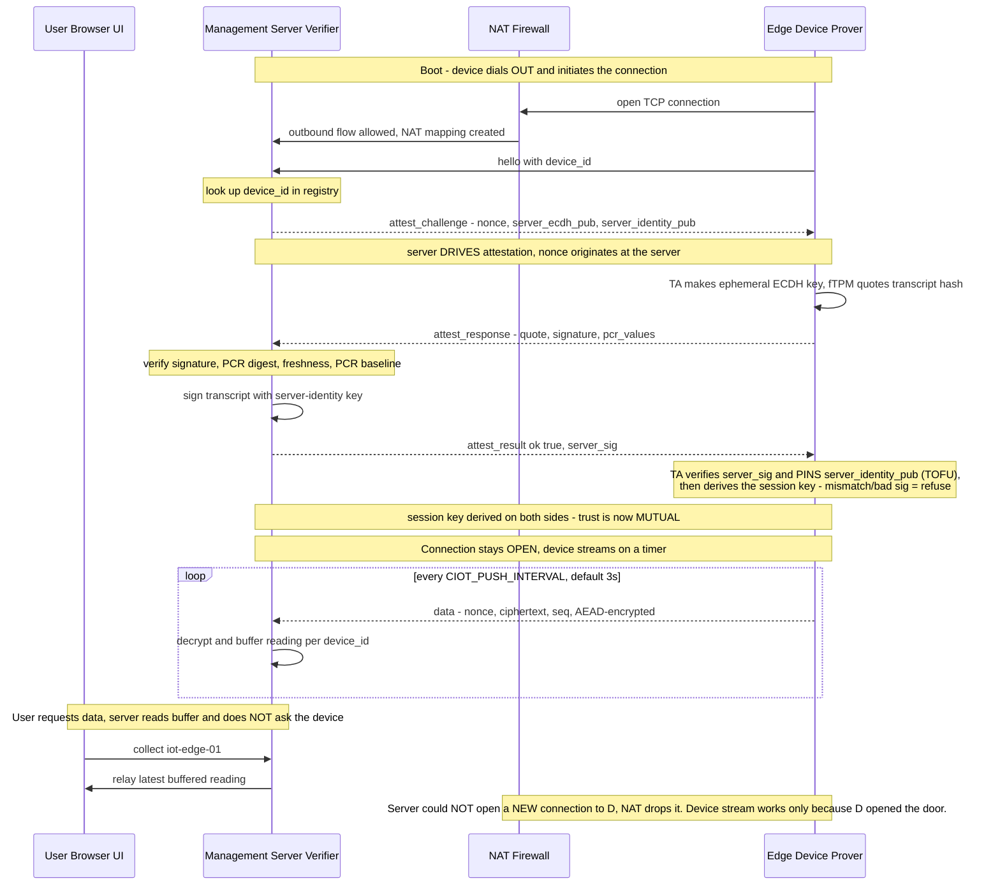

# Connection Initiation Model: Why the Device Speaks First

## The question this document answers

When the Edge Device and the Management Server talk to each other, **which side
opens the connection, and which side drives the attestation?** These are two
separate questions, and getting them right (and keeping them separate) is what
makes the whole design work behind real-world networks.

**Decision:**

- The **Device initiates the connection** (dials out to the server, sends the
  first `hello`).
- The **Server drives the attestation** (issues the fresh nonce / challenge —
  it is the Verifier).
- The device **keeps that outbound connection open** and **pushes readings
  continuously on a timer**. The server **buffers** those readings; the UI's
  "collect" reads from that buffer. "Collect" is a server/UI-side read — it is
  **not** a message sent down to the device.

This document explains how that works and why it is better than the naive
"server connects to the device" model that the original spec flow implied.

> **Heads-up (design decision worth revisiting):** the code today commits to a
> *timer-push* model — the device streams on a fixed interval whether or not
> anyone is watching. An *on-demand* model (device idle, server asks for data
> only when a user wants it) is a real alternative with different trade-offs. See
> [A design decision: timer-push vs. on-demand](#a-design-decision-timer-push-vs-on-demand)
> — please think about which model this project actually wants.

---

## How it works

### 1. The device dials out and says hello

On boot, the device opens a TCP connection **to** the server (the server has a
fixed, publicly-reachable address; the device does not). It sends:

```json
{"type":"hello","device_id":"iot-edge-01"}
```

`hello` carries no secret and proves nothing — it is just "here I am, this is my
device_id." All trust is established by what the server sends *back*.

### 2. The server drives attestation over the same connection

The server looks up `device_id` in its registry and replies **on the connection
the device already opened** — it never opens a new connection back to the
device:

```json
{"type":"attest_challenge","nonce":"<fresh 20-32B>","server_ecdh_pub":"<P-256 point>","server_identity_pub":"<P-256 point>"}
```

The **nonce originates at the server**. This is the crux: the device cannot
pre-compute or replay a response, because it doesn't know the challenge until
the server hands it one. Who opens the socket (device) and who controls trust
(server) are cleanly decoupled — the device initiating contact gives it no
security leverage whatsoever.

The device attests (TPM quote over the transcript hash), the session key is
derived, and from then on data messages are AEAD-encrypted. See
[`ATTESTATION_DESIGN.md`](ATTESTATION_DESIGN.md) for the full attestation and
key-exchange detail.

### 2a. The server also proves *its* identity (mutual trust)

Attestation as described so far is **one-directional**: the device proves
itself to the server. But `hello` proving nothing cuts both ways — on its own
it also gives the *device* no assurance about *who* it is talking to, so a
compromised Host that redirected `SERVER_HOST`/`SERVER_PORT` could point the
device at an impostor. To close that gap, the server now also authenticates
itself: it advertises a dedicated **server-identity public key**
(`server_identity_pub`) in `attest_challenge`, and in `attest_result` it
returns `server_sig` — a fresh ECDSA-P256 signature over *this* session's
transcript. The device's **TA** pins `server_identity_pub` on the first
genuine attestation (Trust-On-First-Use) and, on every handshake, refuses to
derive the session key unless `server_sig` verifies under the pinned key.
Because that check lives in the TA, a compromised Host cannot skip it. See
[`ATTESTATION_DESIGN.md`](ATTESTATION_DESIGN.md) §2.10 and
[`HANDOFF_serverAuthentication.md`](HANDOFF_serverAuthentication.md).

### 3. The connection stays open and the device pushes on a timer

The device does **not** close the connection after attesting. It runs as a
daemon: it keeps the attested session live (re-attesting only when none exists or
the previous one expired — device-driven, not per message) and pushes one
AES-GCM-sealed reading every `CIOT_PUSH_INTERVAL` (default 3s) down the open
connection:

```json
{"type":"data","device_id":"iot-edge-01","seq":42,"nonce":"<b64>","ciphertext":"<b64>"}
```

The server **buffers** these readings per `device_id`. When a user picks a device
in the UI and hits "collect", the server returns what it has buffered for that
device — it does **not** send anything to the device. The device never receives
or acts on a "collect" message; it is unaware the UI exists. This is what lets a
user pick a specific device from the UI ("watch camera 3") even though every
device is the initiator — see
[Device selection in a fleet](#device-selection-in-a-fleet).

The push loop lives in the edge host's `main()`
(`project/optee_examples/confidential_iot/edge_device/host/main.c`); the
"re-attest only when needed" logic is `edge_ensure_session()` in the same
directory's `edge_device.c`. On the server, `AttestedNetworkDeviceLink.collect()`
(`CC_Server/server/device_link/attested_network.py`) simply drains the buffer —
there is no write back to the device anywhere in that path.

---

## The flow



---

## Why this beats the "server initiates" model

### 1. Reachability — the device usually has no address the server can dial

An IoT edge device typically sits behind NAT or a firewall (home router, factory
LAN, cellular carrier NAT). It has **no stable, publicly-routable inbound
address**. The server does. So the only direction a connection can *reliably* be
opened is device → server. A "server connects to the device" design requires
every device to expose a reachable inbound endpoint (port forwarding, static IP,
a firewall hole) — usually impossible, and a configuration nightmare at fleet
scale.

### 2. Attack surface — a device that listens can be attacked

If the device waited for the server to connect *in*, it would have to run a
listening service on an open port, reachable by anything that can route to it —
not just your server. That is an exposed inbound entry point on the
security-critical edge device (the one holding the TA, the TPM, and the session
key). A device that only dials *out* exposes **nothing** inbound — there is no
port for an attacker to knock on.

### 3. No security is lost by letting the device speak first

The worry would be "if the device opens the connection, does it control the
protocol?" — no. `hello` carries no secret. All freshness and trust come from
the server's nonce. The device still cannot produce a valid attestation response
until the server hands it a fresh challenge. **Who opens the socket and who
drives attestation are independent**, and only the second one matters for
security.

### 4. It still supports user-selected, per-device data

The one apparent advantage of server-initiated ("the server can reach out when a
user asks for data") is fully recovered by keeping the device's outbound
connection open: the device streams into a per-`device_id` server buffer, and a
user's "collect" reads the right device's buffer — with none of the reachability
or attack-surface costs. (Whether the device should *stream* or instead wait to
be *asked* is a separate design choice — see
[A design decision: timer-push vs. on-demand](#a-design-decision-timer-push-vs-on-demand).)

---

## NAT: why the reply works even though the device is "unreachable"

"The device is unreachable" specifically means *the server cannot start a new
conversation with it*. It says nothing about **replying within a conversation
the device already started.**

When the device sends its first packet out, the NAT router creates a temporary
mapping:

```
device (192.168.1.50:44321)  ⟷  router public IP:port  ⟷  server:9000
```

- Server sends the nonce / `attest_result` **back over that connection** →
  arrives at the router, matches the existing mapping, forwarded in. ✔ And the
  device's own `data` stream flows *out* through the same mapping the whole time.
- Server tries to originate a **brand-new** connection to the device → no
  matching mapping, router doesn't know which internal host it's for, dropped. ✘

So the server's attestation replies flow back through the door the device opened,
and the device keeps streaming out through it. This is exactly why the device
must keep the connection **open**: once it closes, the NAT mapping expires and the
server can
no longer reach the device until it dials out again.

---

## Device selection in a fleet

A user picking a specific device from the UI ("watch camera 3") works even
though every device is the initiator, because the server is the **rendezvous
point** that every device has already connected to. The server keeps a table of
currently-open device connections keyed by `device_id`:

```
connected_devices = {
    "camera-01": <open socket>,
    "camera-02": <open socket>,
    "camera-03": <open socket>,   ← established when camera 3 dialed in
}
```

"Watch camera 3" becomes: look up `"camera-03"` and read *that* device's buffer —
camera 3 is already streaming into its per-`device_id` buffer over the connection
it opened. The `device_id` is the addressing key — not an IP, not an inbound
port. Attestation is unchanged: camera 3 still attests to the server, the session
key is still per-device; device selection is purely a **routing layer** on top.

**The one real limitation:** you can only reach a device that is *currently
connected*. If it's powered off or its connection dropped, it's not in the table
and the server shows it "offline" and waits for it to dial back in — you cannot
wake it on demand. This is the genuine (and acceptable) trade-off of
device-initiated + NAT, and it's why real fleets show online/offline status and
reconnect aggressively.

---

## A design decision: timer-push vs. on-demand

**This is the one part of the model that is genuinely a choice, not a
constraint — please think about it before building on top.** Everything above
(device dials out, server drives attestation, connection stays open) is forced by
NAT and security. *How the data flows once the connection is up* is not, and the
code currently commits to one of two viable options.

**What the code does today — timer-push.** The device streams a sealed reading
every `CIOT_PUSH_INTERVAL` (default 3s) for as long as it is up, regardless of
whether anyone is watching. The server buffers the latest reading(s); the UI's
"collect" reads the buffer. So the device **is** always sending. With today's
tiny mock reading that is negligible, and for a **slow sensor** (temperature
every few minutes) it stays negligible — the data is small and pushing on a timer
is simple and robust.

**The alternative — on-demand.** The device stays connected but idle, and only
sends a reading when the server pushes a request (e.g. `{"type":"collect"}`) down
the open connection in response to a user. This needs the device to grow an
**inbound command path** (parse and act on server→device messages), which the
current host does not have.

| | Timer-push (current) | On-demand |
|---|---|---|
| Device complexity | Simple — one push loop, no inbound commands | Needs to receive + act on server requests |
| Bandwidth when idle | Always sending (fine for small readings) | ~Zero until a user asks |
| Best for | Slow / small sensors; simplicity | **High-bandwidth devices (cameras)** — frames only flow while someone is watching |
| Latency to "fresh" data | Bounded by the interval | On request |

**The recommendation to weigh:** timer-push is the right call while the payload
is a tiny reading. The moment a real, high-bandwidth sensor (a camera) is
introduced, streaming frames 24/7 into a buffer nobody is reading is exactly the
waste on-demand avoids — at that point revisit this. Pick deliberately; don't
inherit timer-push just because it is what the mock happens to do.

Independently of which model wins: the real cost of "device is the initiator" is
**on the server**, not the device — a fleet of N devices means N open sockets the
server maintains. That's a routine scaling concern (it's why production fleets use
brokers like MQTT), not device waste.

---

## Summary

- **Device initiates the connection**, because it's the only side that can
  (NAT), and doing so keeps its inbound attack surface at zero.
- **Server drives attestation** (issues the nonce) — it is the Verifier, and
  this is independent of who opened the socket.
- **The connection stays open**, and the device **streams readings on a timer**
  into a per-`device_id` server buffer; the UI's "collect" reads that buffer and
  routes user device-selection to the right device — recovering the benefit of a
  server-initiated model with none of its costs. No message is ever sent to the
  device.
- **Timer-push vs. on-demand is a real design choice** — the code streams on a
  timer today, which is fine for small readings but worth revisiting for
  high-bandwidth devices. See
  [A design decision: timer-push vs. on-demand](#a-design-decision-timer-push-vs-on-demand).
