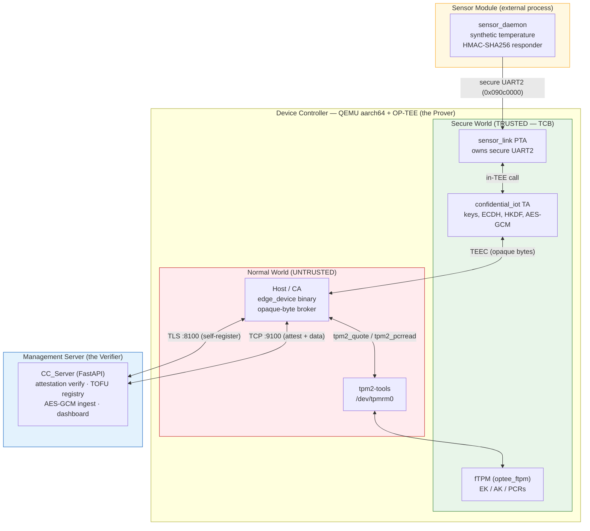
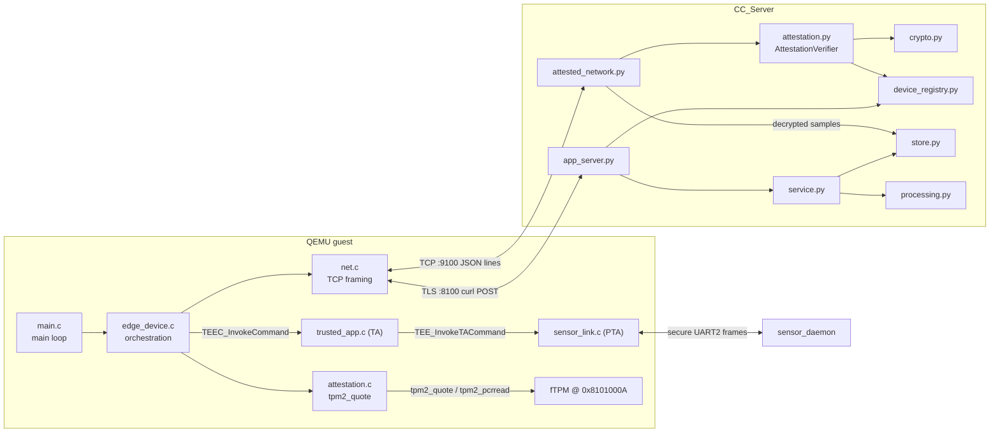
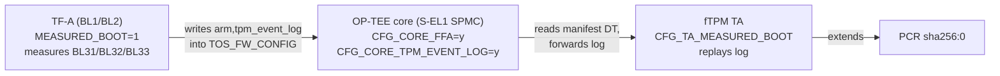
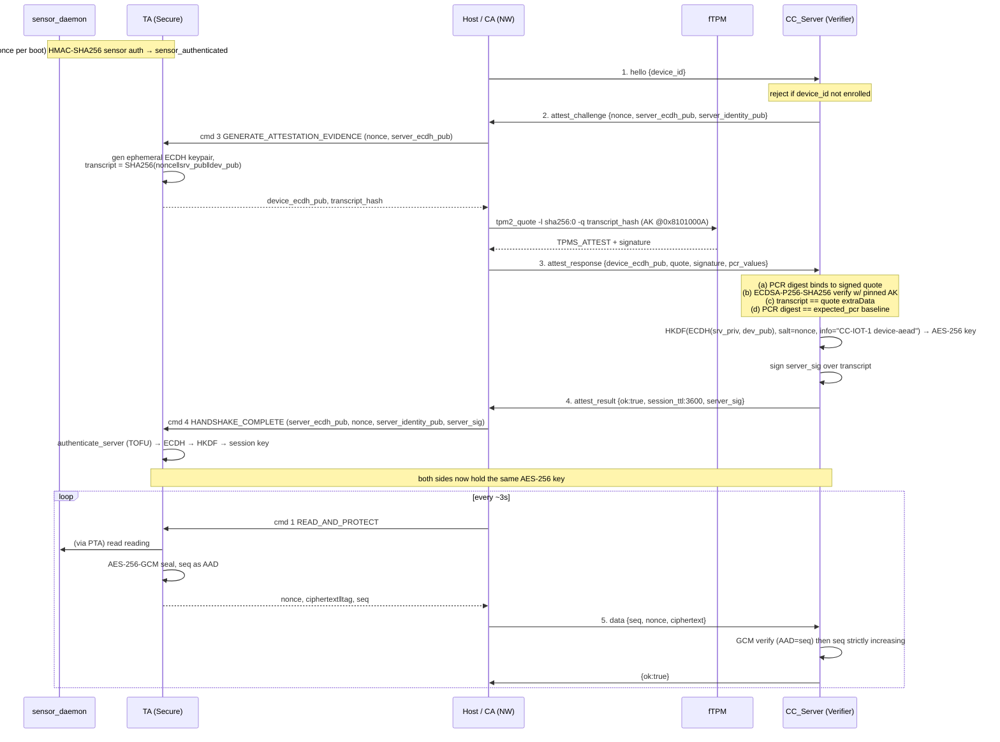
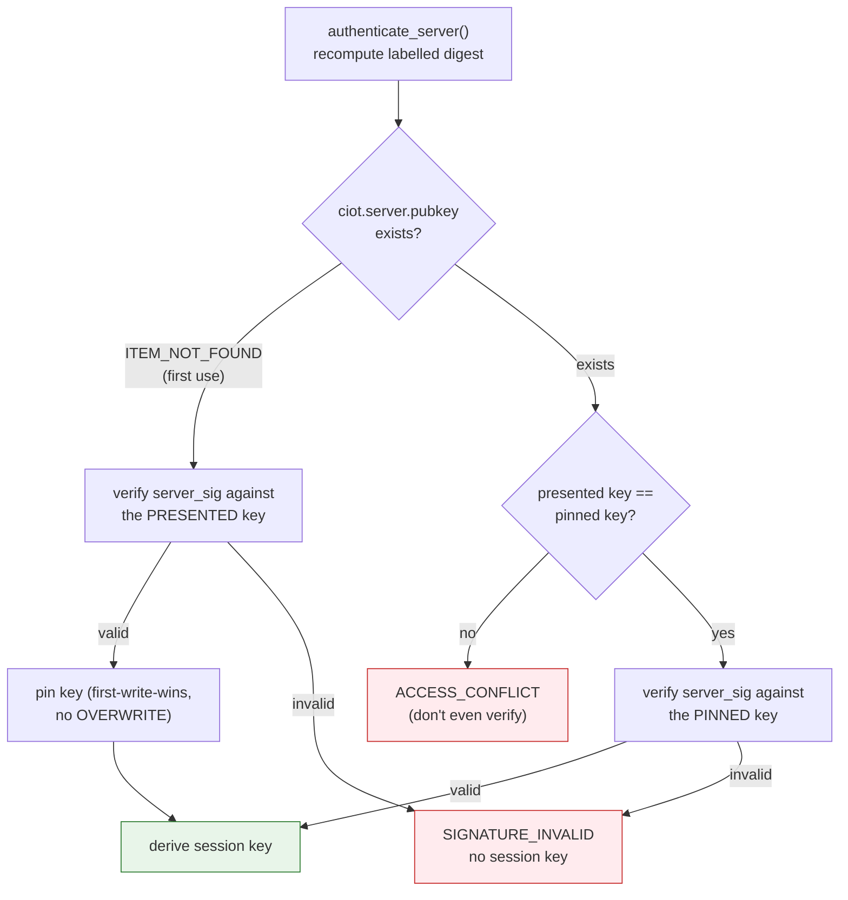
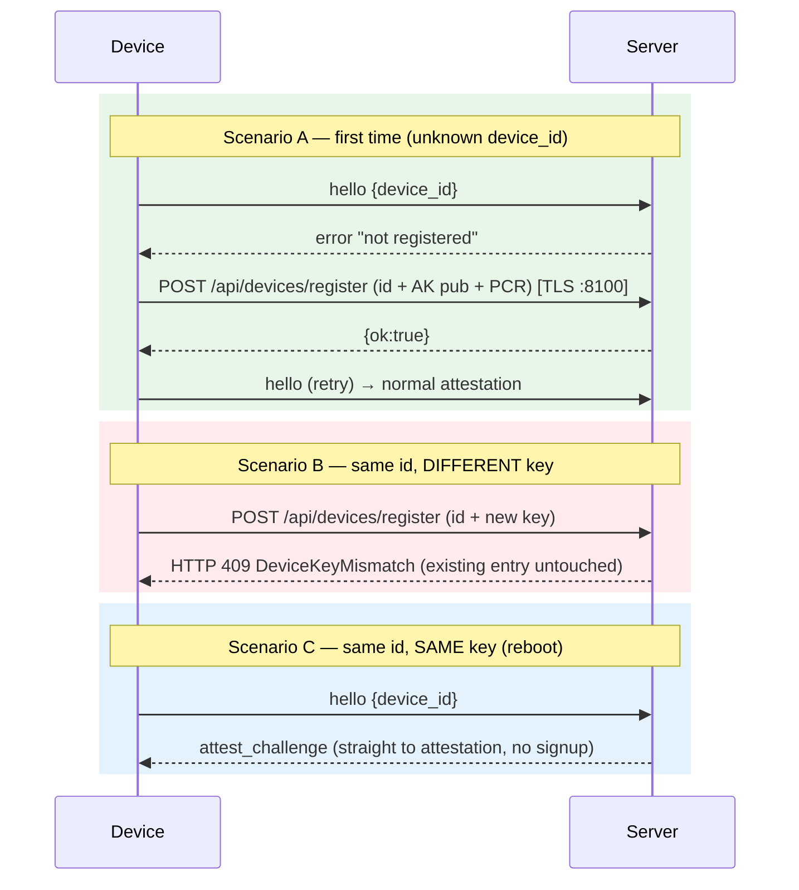
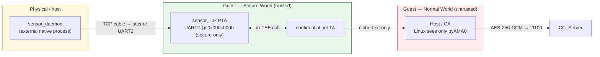
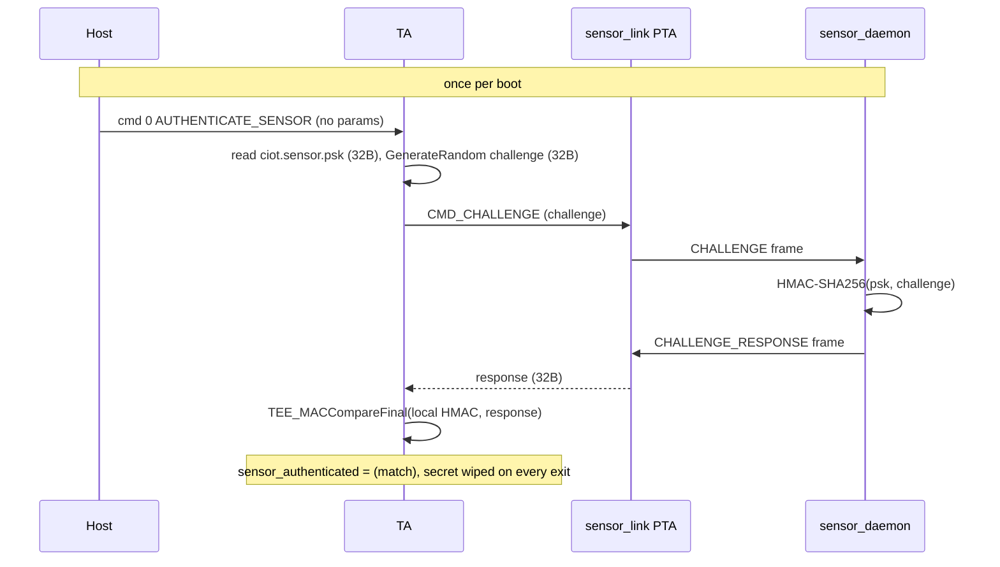
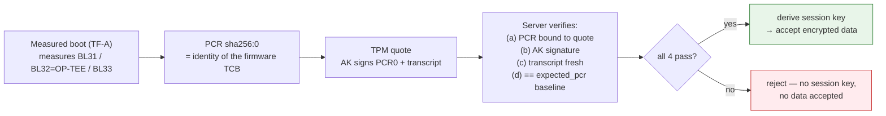
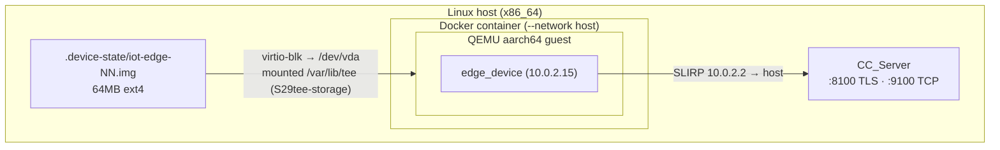

# Confidential Computing — System Design Document

> **Document status:** Draft for the official project documentation.
> **Source of truth:** the project source code and the `docs/*.md` design notes as of **2026-07-18**. Where this document and a scattered note disagree, the *code* wins and this document is intended to become the single authoritative reference.
> **Superseded:** the Hebrew course-plan PDF (`docs/פרויקט סוף קורס...pdf`) describes the *pre-implementation* plan and is **out of date** — do not treat it as a specification of the built system.
> **Scope:** everything actually implemented — device firmware (OP-TEE TA / PTA / Host), the fTPM-based attestation, the secure sensor path, and the Python management server.

---

## Table of Contents

1. [Executive Summary](#1-executive-summary)
2. [Goals, Scope & Non-Goals](#2-goals-scope--non-goals)
3. [Glossary & Terminology](#3-glossary--terminology)
4. [System Architecture](#4-system-architecture)
5. [Component & Module Inventory](#5-component--module-inventory)
6. [Module Interaction Map](#6-module-interaction-map)
7. [Identities, Keys & Secrets](#7-identities-keys--secrets)
8. [Measured Boot, PCR & the fTPM](#8-measured-boot-pcr--the-ftpm)
9. [The Attestation Protocol](#9-the-attestation-protocol)
10. [Server Authentication (Mutual Trust / TOFU)](#10-server-authentication-mutual-trust--tofu)
11. [Device Self-Registration & Reject-on-Mismatch](#11-device-self-registration--reject-on-mismatch)
12. [The Confidential Sensor Path](#12-the-confidential-sensor-path)
13. [TA & PTA Command Reference](#13-ta--pta-command-reference)
14. [What Code Is Signed & How Integrity Is Guaranteed](#14-what-code-is-signed--how-integrity-is-guaranteed)
15. [Data Model & Processing](#15-data-model--processing)
16. [Networking & Deployment](#16-networking--deployment)
17. [Threat Model & Security Guarantees](#17-threat-model--security-guarantees)
18. [Known Limitations & Security Caveats](#18-known-limitations--security-caveats)
19. [Appendix: Quick-Reference Constants](#19-appendix-quick-reference-constants)

---

## 1. Executive Summary

This project implements **remote attestation for an IoT edge device** on ARM TrustZone, using OP-TEE running on a QEMU `aarch64` virtual machine, a firmware TPM (fTPM), a hardware-isolated secure sensor peripheral, and a Python management server.

The core idea: **a device must cryptographically prove it is running untampered firmware before the server accepts any data from it.** The device produces a TPM 2.0 *quote* — a signature, made by a per-device Attestation Key held inside the fTPM, over the platform's measurement register (PCR 0) plus a fresh server-chosen challenge. The server verifies that quote against a pinned known-good baseline. Only if the proof holds do the two sides derive a shared session key and the device begins streaming **AES-256-GCM-encrypted** sensor readings.

The trust is **mutual and layered**:

- The **server** verifies the **device** (via the TPM quote) — the device cannot lie about what firmware it runs.
- The **device** verifies the **server** (via a pinned server-identity signature, TOFU-style) — a compromised host process cannot redirect the device to an impostor server.
- The **Trusted Application** verifies the **sensor** (via an HMAC challenge-response) — and the untrusted Host never sees sensor plaintext.

The unifying design principle throughout is: **never trust the counterpart's self-report.** Every trust decision is enforced by the party that has something to lose, inside a trust boundary the adversary cannot cross.

---

## 2. Goals, Scope & Non-Goals

### Goals

- **Remote attestation** of an IoT edge device to a management server, rooted in a TPM quote.
- **Mutual authentication** — device-authenticates-server as well as server-authenticates-device.
- **A confidential sensor data path** — sensor plaintext is readable only inside the TEE; it never appears in Normal-World (untrusted) memory.
- **Confidential, integrity-protected, replay-resistant** telemetry from device to server.
- **Persistent per-device identity** that survives reboots.

### Scope

- A single simulated edge device (extensible to several concurrent instances) built on QEMU + OP-TEE + Buildroot Linux.
- A Python FastAPI management/ingest server with a small browser dashboard.
- All cryptography and key material described here as *actually implemented in the code*.

### Non-Goals / Explicitly Out of Scope

- Real silicon. The target is QEMU virtualization; several roots of trust (HUK, EPS) are stable software values under emulation (see [§18](#18-known-limitations--security-caveats)).
- Production key-management / PKI, certificate revocation, or an enrollment authority. Enrollment is TOFU + a file-permission boundary.
- Physical extraction of the sensor's pre-shared key from genuine sensor hardware (decapping / side-channel / glitching a real secure element), or physical tampering with the analog sensing path so that a still-authenticating sensor reports false values. **Note:** sensor *replacement / impersonation* is **in scope and defended** — a substitute sensor that lacks the PSK fails the HMAC-SHA256 challenge-response, so `sensor_authenticated` stays false and no data flows (see [§12](#12-the-confidential-sensor-path)).

---

## 3. Glossary & Terminology

### TCG / TPM ecosystem

| Term | Meaning |
|---|---|
| **TCG** | Trusted Computing Group — the standards body behind the TPM spec, measured boot and attestation. |
| **TPM / TPM 2.0** | Trusted Platform Module — an isolated component holding keys that never leave it. TPM 2.0 is the current spec. |
| **fTPM** | Firmware TPM — a software TPM 2.0 implementation running in an isolated environment. Here it is `optee_ftpm` (a port of Microsoft's `ms-tpm-20-ref`) running as an OP-TEE TA. UUID `bc50d971-d4c9-42c4-82cb-343fb7f37896`. |
| **EK (Endorsement Key)** | The TPM's root identity key, derived from the EPS, parent of the AK. |
| **EPS (Endorsement Primary Seed)** | Root secret from which the EK is derived. Under the QEMU simulator this is derived from non-secret values (MAC / disk serial) — simulation-only. |
| **AK (Attestation Key)** | A *restricted* signing key created under the EK. It can only sign TPM-internal structures (quotes), never arbitrary data. Per-device; its public half lives in the server registry. |
| **PCR (Platform Configuration Register)** | A register that can only be *extended*: `PCR[n] = SHA256(PCR[n] ‖ measurement)`. Resets to all-zero at every power-on. This project quotes **`sha256:0`** (PCR index 0, SHA-256 bank). |
| **Measured Boot** | Hashing (measuring) each boot stage into PCRs so the final PCR value reflects exactly what code ran. |
| **Event Log (TCG Event Log)** | An ordered record of what was measured; the fTPM replays it during TA init to reconstruct the PCRs. |
| **Quote (`TPM2_Quote`)** | Signs `{selected PCR values, caller-supplied qualifying data}` with the restricted AK. Output is a `TPMS_ATTEST` body + a signature. |
| **TPMS_ATTEST / TPM2B_ATTEST** | The quote's signed body / its length-prefixed wire form (2-byte big-endian size prefix). |
| **TPMT_SIGNATURE** | The signature structure: algorithm (ECDSA), hash (SHA-256), and raw `(r, s)`. |
| **Qualifying data / extraData** | Caller-supplied bytes folded into the signed quote. Here it carries the **Transcript Hash**. |
| **Transcript Hash** | Project term: `SHA-256(nonce ‖ server_ecdh_pub ‖ device_ecdh_pub)`. Binds the quote to a specific live handshake. |
| **tpm2-tools / tpm2-tss** | Userspace CLI + the TCG Software Stack. The device uses `tpm2_quote`, `tpm2_createak`, `tpm2_pcrread`, etc. |
| **TCTI** | TPM Command Transmission Interface. `device` TCTI → `/dev/tpmrm0` (real fTPM); `mssim` TCTI → simulator over TCP. |

### OP-TEE / TrustZone ecosystem

| Term | Meaning |
|---|---|
| **TEE** | Trusted Execution Environment. |
| **ARM TrustZone** | Hardware split into **Secure World (S)** and **Normal World (NW)**. The root of the threat model. |
| **OP-TEE** | The open-source Secure-World OS. |
| **TA (Trusted Application)** | Code running in Secure World at S-EL0 under OP-TEE. Here: `confidential_iot`, UUID `7d9f6d20-5f11-4d0c-9a17-61c9c91c0001`. |
| **Host / CA (Client Application)** | The Normal-World program (GlobalPlatform "Client Application"). Here the `edge_device` binary. **Explicitly untrusted** — it only shuttles opaque bytes. |
| **PTA (Pseudo Trusted Application)** | C compiled *into* OP-TEE core, running at S-EL1. It can map MMIO / drive hardware that a sandboxed TA cannot. Here: `sensor_link`, UUID `7d9f6d20-5f11-4d0c-9a17-61c9c91c0002`. |
| **TEEC / TEE Client API** | Normal-World API to call the TA (`TEEC_InitializeContext`, `TEEC_OpenSession`, `TEEC_InvokeCommand`). |
| **GP Internal Core API** | TA-side API for crypto/storage (`TEE_GenerateKey`, `TEE_DeriveKey`, `TEE_AEEncryptFinal`, ...). |
| **TCB (Trusted Computing Base)** | Here: OP-TEE OS + the TA + the server internals. Normal-World Linux is **outside** it. |
| **TF-A (Trusted Firmware-A)** | ARM's reference secure firmware; the first boot code. Produces the measured-boot event log. |

### Cryptography

| Term | Meaning |
|---|---|
| **ECDH** | Elliptic-Curve Diffie-Hellman key agreement (curve P-256). |
| **ECDSA** | Elliptic-Curve Digital Signature Algorithm (curve P-256, hash SHA-256). Signs the TPM quote and the server-identity proof. |
| **P-256 / secp256r1 / NIST P-256** | The single elliptic curve used everywhere in this project. |
| **HKDF** | HMAC-based key-derivation function. Here: `salt` = attestation nonce, `info` = a domain-separating label. |
| **AEAD / AES-GCM** | Authenticated encryption. The device→server `data` channel uses **AES-256-GCM**. |
| **Nonce (two kinds)** | (1) the **32-byte attestation nonce**, fresh per challenge; (2) the **12-byte AES-GCM nonce**, fresh per encrypted message. |
| **TOFU** | Trust On First Use — pin a public key the first time it is seen, then require it to match forever after. |
| **Prover / Verifier** | The Device (Prover) proves; the Server (Verifier) checks. |
| **SLIRP / NAT** | QEMU user-mode networking; the emulated device dials out through NAT and is unreachable inbound. |

---

## 4. System Architecture

The system follows the course's three-tier chain:

```
Sensor Module  →  Device Controller (QEMU ARM + OP-TEE/TrustZone)  →  Management Server
   (Prover's sensor)          (the Prover)                                 (the Verifier)
```

- The **Device is the Prover**; the **Server is the Verifier** — the classic remote-attestation roles.
- Within the device, the fundamental split is **TrustZone Secure World vs. Normal World**. The **Host (CA)** lives in Normal World and is assumed hostile; the **TA + OP-TEE core + fTPM** live in Secure World and are trusted.
- The **sensor** is a separate process outside the guest entirely, reached only over a **secure-only UART** that Normal World cannot see.



---

## 5. Component & Module Inventory

### Device side (`project/`)

| Component | File(s) | World / Level | Identity | Responsibility |
|---|---|---|---|---|
| **Trusted Application** | `edge_device/ta/trusted_app.c` | Secure, S-EL0 | UUID `7d9f6d20-…-0001` | Holds all device secrets & session key; ECDH/HKDF/AES-GCM; server TOFU; sensor HMAC verify. Installed at `/lib/optee_armtz/7d9f6d20-…-0001.ta`. |
| **Host / CA** | `edge_device/host/main.c`, `edge_device.c`, `net.c` | Normal | binary `optee_example_confidential_iot_edge` | Orchestrates: opens the TA session, drives the network protocol, shuttles **opaque** bytes. Untrusted. |
| **Attestation helper** | `attestation/attestation.c`, `.h` | Normal | (linked into CA) | Shells out to `tpm2-tools` to produce the quote + PCR readout. |
| **sensor_link PTA** | `optee_os_ext/core/pta/sensor_link.c`, `lib/libutee/include/pta_sensor_link.h` | Secure, S-EL1 (core) | UUID `7d9f6d20-…-0002` | Owns the secure UART2; relays raw frames between the sensor and the TA. Caller allowlist = the TA only. |
| **Sensor daemon** | `sensor_module/sensor_daemon.c`, `sensor_link_proto.h` | External native process | — | Emulates the physical sensor: HMAC-SHA256 challenge-response + synthetic readings over a TCP "cable." |
| **fTPM** | `optee_ftpm` (`ms-tpm-20-ref`) | Secure, S-EL0 (TA) | UUID `bc50d971-…-7896` | The TPM 2.0: EK, per-device AK at handle `0x8101000A`, PCRs. Reached only via `/dev/tpmrm0` + tpm2-tools. |

### Server side (`CC_Server/server/`)

| Module | Responsibility |
|---|---|
| `main.py` | Entry point. Parses `--security/--host/--port`, builds the app, forces **TLS 1.3**, runs uvicorn. |
| `app_server.py` | FastAPI app factory + all HTTP/WS routes; mounts the static UI. |
| `service.py` | `CollectionService` — orchestrates one "collect": validate → `device_link.collect()` → `store.add()` → `store.window()` → `processing.aggregate()`. |
| `attestation.py` | The **Verifier**: `AttestationVerifier`, TPM quote parsing, PCR-digest recompute, signature verify, transcript/nonce checks, session-key derivation, anti-replay, server-identity signing. |
| `crypto.py` | Primitives: P-256 ECDH, HKDF-SHA256, AES-256-GCM, server-identity key load/sign. Built on the `cryptography` library. |
| `store.py` | `DataStore` — per-device bounded ring buffers (`deque(maxlen=100_000)`) + time-window filter. |
| `device_registry.py` | `DeviceRegistry` + `DeviceRecord` — persistent JSON of enrolled identities; TOFU enrollment w/ mismatch rejection. |
| `processing.py` | `aggregate()` — raw / mean / min / max / weighted_avg reductions. |
| `config.py` | `Config` frozen dataclass + `CONFIG` singleton — the only place `MS_*` env vars are read. |
| `constants.py` | Fixed protocol/app constants (lengths, labels, TTLs, TPM magic numbers). |
| `device_link/base.py` | `DeviceLink` ABC + `Sample` / `Batch` dataclasses (the data-source seam). |
| `device_link/network.py` | `NetworkDeviceLink` — legacy plaintext link that trusts a self-reported `attested` flag (demo only). |
| `device_link/attested_network.py` | `AttestedNetworkDeviceLink` — the **real** attestation-gated TCP link with AES-GCM envelopes. |
| `transport/base.py`, `transport/tls.py` | `UserChannel` ABC + `TlsUserChannel` (TLS 1.3, self-signed RSA cert) — the browser-facing transport seam. |
| `reset_registry.py` | Utility to remove/clear registry entries (re-provisioning). |
| `web/` | Static browser dashboard (`index.html`, `app.js`, `styles.css`). |

The two abstraction seams (`DeviceLink`, `UserChannel`) keep the HTTP routes free of any crypto/transport detail — either side can be swapped without touching business logic.

---

## 6. Module Interaction Map

The device has **two network faces** to the server and one in-guest chain to the sensor:

- **`:9100` (plain TCP)** — the device-facing attestation + telemetry link. Confidentiality/integrity come from the *application layer* (ECDH+HKDF+AES-GCM) and the TPM quote — **not** from TLS.
- **`:8100` (TLS 1.3)** — the browser/admin API. The device touches this only for self-registration.

> On ports: **8100 / 9100** are the operative ports (see [§16](#16-networking--deployment)); `8000 / 9000` are only the code defaults and are typically already taken on the host.



**Narrative of a full boot (function-level):**

1. `main.c:main` → `edge_device_init` opens a persistent TEEC session to the TA.
2. `edge_authenticate_sensor` → TA cmd 0 `ta_authenticate_sensor` → `open_sensor_pta` → PTA `CMD_CHALLENGE` → over UART2 to `sensor_daemon.handle_challenge` → TA verifies HMAC with `TEE_MACCompareFinal`, sets `sensor_authenticated`.
3. `edge_ensure_session` → `edge_attest_to_server` opens TCP `:9100`, exchanges `hello`/`attest_challenge`, calls TA cmd 3 `ta_generate_attestation_evidence` (ephemeral ECDH + transcript hash), then `create_attestation_report` (`tpm2_quote`), sends `attest_response`.
4. `edge_handshake` → TA cmd 4 `ta_handshake_complete` → `authenticate_server` (TOFU) → ECDH + HKDF → session key.
5. Loop: `edge_call_ta` → TA cmd 1 `ta_read_and_protect` → PTA `CMD_READ` → sensor reading → AES-256-GCM seal → `edge_send_sensor_data_to_server` pushes a `data` message.

---

## 7. Identities, Keys & Secrets

Every key/secret in the system, where it lives, and what it protects:

| Key / secret | Algorithm & size | Where it lives | Persistence | Protects / signs |
|---|---|---|---|---|
| **fTPM EK (Endorsement Key)** | ECC P-256 | fTPM secure storage | Per boot (derived) | Root identity; parent of the AK. |
| **fTPM AK (Attestation Key)** | ECC P-256, ECDSA, SHA-256, *restricted* | fTPM, persistent handle **`0x8101000A`** | Survives reboot (persistent disk) | Signs every **TPM quote** (PCR0 + transcript hash). Public half pinned in the server registry. |
| **Server identity key** | ECDSA P-256 (PKCS8) | `server/certs/server_identity_key.pem` | Persistent; **never regenerated** | Signs the per-session `server_sig` proving server identity to the device (TOFU-pinned by the device). |
| **Server TLS key + cert** | RSA 2048, self-signed X.509 | `server/certs/server_key.pem` + `server_cert.pem` | Persistent (regenerated if missing) | The TLS 1.3 browser/admin channel (`:8100`). Separate from the identity key. |
| **Pinned server pubkey (device side)** | 65-byte SEC1 P-256 point | TA secure storage, object `ciot.server.pubkey` | Persistent, first-write-wins | The device's TOFU anchor for the server's identity. |
| **Sensor PSK** | 32-byte pre-shared secret | TA secure storage, object `ciot.sensor.psk`; sensor side in a `--secret` file | Persistent (idempotent write) | HMAC-SHA256 sensor authentication. |
| **Device ephemeral ECDH keypair** | ECDH P-256 | TA session RAM only | Single-use per attestation | Derives the session key. Freed after the handshake. |
| **Session key** | AES-256 (32 bytes) | TA session RAM + server `DeviceSession` | Per session (TTL 3600 s) | AES-256-GCM sealing of every `data` message. **Never leaves the TA on the device side.** |

Two design notes worth highlighting:

- **The AK is not the device's transport identity by chance — it is by design.** The AK lives in the fTPM and is `restricted` (can sign only TPM structures). It cannot be coerced into signing attacker-chosen data, so the quote is a trustworthy statement about firmware, nothing else.
- **The server has two distinct keys on purpose.** The RSA TLS cert secures the browser channel; the P-256 *identity* key authenticates the server to devices with a lightweight 64-byte raw signature the TA can verify without ASN.1 parsing.

---

## 8. Measured Boot, PCR & the fTPM

### The fTPM

`optee_ftpm` is a port of Microsoft's `ms-tpm-20-ref` running as an OP-TEE TA (UUID `bc50d971-…-7896`). It is a **hard build dependency** (`build/common.mk: optee-os-common: ftpm`). The Linux kernel has `CONFIG_TCG_TPM=y` / `CONFIG_TCG_FTPM_TEE=y` built in, so `/dev/tpm0` and `/dev/tpmrm0` appear at boot with no `modprobe`. In this project the fTPM is used **narrowly, as a signing oracle over public data** — it quotes a hash of the (public) handshake transcript and the (public) PCR values; it never touches a secret the rest of the system relies on for confidentiality.

### Which PCR

The protocol quotes exactly **`sha256:0`** — PCR index 0, SHA-256 bank. PCRs reset to all-zero on every power-on and can only be *extended*.

### The measured-boot chain (real, firmware-rooted)

Measured boot is **active and rooted in the boot firmware** — as hardware-rooted as an emulated boot chain can be. The device runs the **FF-A / S-EL1 SPMC** topology (`SPMC_AT_EL=1`): OP-TEE runs as the Secure-EL1 SPMC, which is what lets TF-A hand it the TCG event log through the `TOS_FW_CONFIG` manifest.



1. **TF-A measures the boot images** — BL31, **BL32 (OP-TEE core)**, BL33 — into the TCG event log (`MEASURED_BOOT=1 EVENT_LOG_LEVEL=20 TPM_HASH_ALG=sha256`). `plat/qemu/qemu/qemu_measured_boot.c` maps every image to `PCR_0`.
2. **TF-A hands the log to OP-TEE** by writing an `arm,tpm_event_log` node (`tpm_event_log_sm_addr` + `tpm_event_log_size`) into the `TOS_FW_CONFIG` manifest DTB. *Upstream TF-A ships this as an empty stub for `SPD=spmd`; the project supplies `project/patches/tfa-tos-fw-config-eventlog.patch` to implement it (`qemu_set_tos_fw_info()`) — without it PCR0 would stay all-zero even under FF-A.*
3. **OP-TEE core** (the S-EL1 SPMC) reads the log from its manifest DT (`get_manifest_dt()`, enabled by `CFG_CORE_FFA=y`, which `CFG_CORE_SEL1_SPMC=y` auto-forces, plus `CFG_CORE_TPM_EVENT_LOG=y`) and forwards it to the fTPM.
4. **The fTPM** (`CFG_TA_MEASURED_BOOT`) replays the log, extending **PCR sha256:0** — before Linux userspace ever runs.

The topology switch and the TF-A patch are applied by `scripts/sync-project.sh` (it flips the `qemu_v8.mk` `SPMC_AT_EL` default to `1` and `git apply`s the patch). `SPMC_AT_EL` is a single source of truth read by both the build and the run, keeping the built firmware and the QEMU launch topology in lockstep.

### What is and isn't measured

- **Measured into PCR0:** the firmware / secure-world TCB — the TF-A stages and **OP-TEE core (BL32)**, plus BL33. Any change to these → different PCR0 → attestation rejected.
- **Not measured:** the Linux kernel + rootfs (the chain isn't extended into U-Boot/Linux), and the **Normal-World Host binary** (`optee_example_confidential_iot_edge`). The Host is *untrusted by design* — all security gates live in the TA — so this is consistent with the threat model ([§17](#17-threat-model--security-guarantees)).
- **TA integrity is covered transitively, not by PCR0 directly:** OP-TEE core verifies every TA's signature before loading it (see [§14](#14-what-code-is-signed--how-integrity-is-guaranteed)); because OP-TEE core is itself measured, that guarantee is rooted in PCR0.

Because the fTPM replays the log at boot (and PCRs zero on power-on), PCR0 is populated automatically every boot — deterministic across reboots of the same image, different if any measured firmware image changes. `provision-device.sh` simply reads it (`tpm2_pcrread sha256:0`) as the enrollment baseline.

> **Historical note.** An earlier revision used a Normal-World software stand-in (`provision-device.sh:software_measure_pcr0`, which ran `tpm2_pcrextend` over the TA + Host binaries from userspace) because the previous `opteed` topology never delivered the event log to the fTPM (core logged `TPM: Fail to find TPM node`). That stand-in was **not hardware-rooted** — a compromised OS could extend the "good" hashes while running tampered code — and has been **removed** in favour of the real chain above. See [§18](#18-known-limitations--security-caveats) for what remains outside the measurement.

---

## 9. The Attestation Protocol

### Transport & framing

- **One continuous plain-TCP connection** on the device-facing port (`:9100`).
- **Newline-delimited JSON**, one object per line. Binary fields are base64.
- No TLS on this port — confidentiality/integrity come from the application layer.

### The five messages

```
1. device → server   {"type":"hello","device_id":"..."}
2. server → device   {"type":"attest_challenge","nonce":"<b64>",
                       "server_ecdh_pub":"<b64>","server_identity_pub":"<b64>"}
3. device → server   {"type":"attest_response","device_id":"...","device_ecdh_pub":"<b64>",
                       "quote":"<b64>","signature":"<b64>","pcr_values":"<text>"}
4. server → device   {"type":"attest_result","ok":true,"session_ttl":3600,"server_sig":"<b64>"}
                    | {"type":"attest_result","ok":false,"error":"..."}
5. device → server   {"type":"data","device_id":"...","seq":<int>,"nonce":"<b64>","ciphertext":"<b64>"}
   server → device   {"ok":true} | {"ok":false,"error":"..."}     (repeatable, per-message ack)
```

Field reference:

| Field | Size / type | Meaning |
|---|---|---|
| `nonce` | 32 bytes (b64) | Server-chosen, fresh per challenge. Anti-replay + HKDF salt. |
| `server_ecdh_pub` / `device_ecdh_pub` | 65 bytes SEC1 uncompressed point (b64) | Ephemeral P-256 public keys for the ECDH exchange. |
| `server_identity_pub` | 65 bytes SEC1 point (b64) | The server's persistent identity public key (like a cert in ServerHello). |
| `quote` | `TPM2B_ATTEST` (b64) | The signed `TPMS_ATTEST` body, length-prefixed. |
| `signature` | `TPMT_SIGNATURE` (b64) | ECDSA `(r, s)` over the quote body. |
| `pcr_values` | text | Raw `tpm2_pcrread sha256:0` output, so the server recomputes the digest independently. |
| `server_sig` | 64 bytes raw `r‖s` (b64) | Server-identity ECDSA proof (see [§10](#10-server-authentication-mutual-trust--tofu)). |
| `seq` | uint32 | Monotonic per-session counter; authenticated as GCM AAD. |

### The sequence



### The four server-side verification checks

All four must pass (`attestation.py:143-223`, `verify_and_derive`):

- **(a) PCR-digest binding** — recompute the digest from the reported `pcr_values` text and require it to equal the `pcrDigest` embedded *inside* the signed quote. The device cannot report PCR values out-of-band from what it signed.
- **(b) Signature verification** — verify `signature` over the exact marshaled `TPMS_ATTEST` body using the device's **pinned AK** — **ECDSA / P-256 / SHA-256**. (`(r,s)` are DER-wrapped for the `cryptography` library.)
- **(c) Transcript / freshness** — recompute `SHA-256(nonce ‖ server_ecdh_pub ‖ device_ecdh_pub)` from the server's own nonce + keys and require it to equal the quote's `extraData` (qualifying data). Binds the quote to this live session; blocks replay.
- **(d) Integrity baseline** — require the verified PCR digest to equal the registry's `expected_pcr` captured at enrollment. This is the "is it running known-good firmware?" check.

Only if all four pass does the server derive the session key:

```
session_key = HKDF-SHA256( ECDH(server_priv, device_ecdh_pub),
                           salt = nonce,
                           info = b"CC-IOT-1 device-aead" )   → 32 bytes (AES-256)
```

The distinct `info` label domain-separates this key from any other channel so keys can never collide.

### Two parsing details

- **`parse_tpms_attest()`** hand-parses `TPM2B_ATTEST`/`TPMS_ATTEST` per TPM 2.0 Part 2 (magic `0xFF544347`, attest type `0x8018`, extraData, PCR selection, combined digest). **`parse_tpmt_signature_ecdsa()`** parses the `TPMT_SIGNATURE` (`sigAlg` must be ECDSA `0x0018`).
- **The TPM2B size-prefix fix.** `tpm2_quote -m` writes the bare `TPMS_ATTEST` body with **no** length prefix, but the server parses a `TPM2B_ATTEST`. So `attestation.c` prepends the 2-byte big-endian size before base64-encoding. The signature covers only the body, so this is cryptographically inert — purely a framing fix.

### Session lifecycle

`session_ttl` = **3600 s**. The device re-attests only when it has no session or the previous one expired (`edge_ensure_session`), device-driven, not per message. The per-session sequence counter resets to 0 on each fresh attestation on both sides.

---

## 10. Server Authentication (Mutual Trust / TOFU)

**The gap this closes:** the device-facing port has no TLS, and quote data is public. A compromised Host that redirects `SERVER_HOST`/`SERVER_PORT` could point the device at an impostor server that simply answers `"ok": true` — and the device would derive a real session key with the attacker. Server authentication removes this.

### Mechanism (TLS-like, two-phase)

The server holds a persistent **ECDSA P-256 identity key** (`crypto.ensure_server_identity_key`, `certs/server_identity_key.pem`), loaded once and **never regenerated** (regenerating would lock out every device that pinned the old key).

- **Phase 1 (like a certificate in ServerHello):** the 65-byte identity public point travels early, as `server_identity_pub` in `attest_challenge`.
- **Phase 2 (like CertificateVerify):** after all device checks pass, the server signs a labelled pre-image and returns it as `server_sig` in `attest_result`:

```
pre_image = "CC-IOT-1 server-identity" ‖ nonce ‖ server_ecdh_pub(65B) ‖ device_ecdh_pub(65B)
server_sig = ECDSA-P256-SHA256(server_identity_key, pre_image)   →  raw 64-byte r‖s
```

The distinct label `"CC-IOT-1 server-identity"` (used without its NUL) prevents any cross-protocol confusion with the device's quote transcript. The server DER→raw re-encodes the signature (each of `r`, `s` left-padded to 32 bytes) so the TA verifies it with `TEE_AsymmetricVerifyDigest` and never parses ASN.1.

### The verdict lives in the TA

`ta_handshake_complete` → `authenticate_server()` recomputes the labelled digest (reconstructing `device_ecdh_pub` from its still-live ephemeral keypair) and opens persistent object `ciot.server.pubkey`:



Key property: **TOFU skips the comparison on first use, never the verification** — a garbage first-use signature is still rejected. Either failure means `session_key_valid` stays false and no `data` ever flows.

### Fresh-TOFU-on-rebuild coupling

A genuine rebuild can rotate the server identity key. To avoid permanently locking out a pinned device, `build.sh` writes a per-build `.build-stamp`; `run-project.sh` diffs it against a per-instance stored stamp, and on a real change **wipes the whole device disk** (new AK + fresh TOFU pin) and drops the stale registry entry. This is deliberately coupled to *destroying the AK* so it can't be a quiet bypass a Host could trigger. A plain relaunch or a guest `reboot` (unchanged stamp) keeps the pin.

The net effect is **two independent trust gates** on the session key: the server verifies the device's quote **and** the device verifies the server's identity signature.

---

## 11. Device Self-Registration & Reject-on-Mismatch

Enrollment happens over the **authenticated TLS admin API** (`POST /api/devices/register` on `:8100`), never over the open device port. The device itself calls it via `curl -k` (BusyBox `wget` has no HTTPS; `-k` because the cert is self-signed). `curl` is added via `BR2_PACKAGE` in `project/buildroot/packages.conf`.

Enrollment record:

```json
{"device_id":"iot-edge-01",
 "ak_pub_pem_b64":"<base64 of AK public PEM>",
 "expected_pcr":"  sha256:\n    0 : 0x...\n",
 "pcr_bank":"sha256:0"}
```

The registry stores `{device_id → ak_pub_pem, expected_pcr, pcr_bank, created_at}` in `device_registry.json`, written atomically and `chmod 0600`. **That file mode is the entire authorization boundary** — whoever can edit the file is the admin. There is deliberately no admin token or force flag.

Three behaviors:



- **Scenario B is the security property:** an already-registered `device_id` can never be silently taken over by a new key — the server returns **HTTP 409 `DeviceKeyMismatch`** and leaves the original entry intact.
- **First-come-first-served caveat:** nothing stops a fake device pre-registering a *made-up* ID (accepted trade-off, [§18](#18-known-limitations--security-caveats)); the guarantee is only *no silent takeover of an existing ID*.

**Reset tooling.** Wiping a device's AK disk (`rm -f .device-state/iot-edge-NN.img`) forces a new AK, which then collides (409) with the old registry entry. `scripts/reset-device-registry.sh` (`--list`, `<id>`, `--all`) → `python -m server.reset_registry` → `DeviceRegistry.remove()/.clear()` clears it. **Gotcha:** `DeviceRegistry` loads the JSON once at startup and never reloads — restart CC_Server after editing.

---

## 12. The Confidential Sensor Path

**The property:** sensor plaintext is readable only inside the TEE. It never touches Normal-World memory. Previously the Host staged sensor plaintext in its own buffer and `ta_authenticate_sensor` was an always-succeed stub — both are now real.

### Topology & trust boundary



No arrow crosses from `sensor_daemon` into Normal World. Linux enumerates only `ttyAMA0`; UART2 is invisible to it (device-tree `status="disabled"`, `secure-status="okay"`).

### The secure UART2

`project/patches/virt-uart2.patch` adds a third PL011 UART (`VIRT_UART2`) to the QEMU `virt` machine: MMIO base **`0x090c0000`** (size `0x1000`), IRQ **SPI 10**, created with `create_uart(..., secure_sysmem, serial_hd(2), true)` — `secure=true` reuses UART1's isolation path so only Secure World can reach it. Applied idempotently (`git apply --reverse --check`).

### The sensor_link PTA (why a PTA, not a TA)

An ordinary TA runs at S-EL0, sandboxed — it **cannot map arbitrary physical MMIO**. Only OP-TEE core (S-EL1) can. So `sensor_link` is compiled into core as a **Pseudo-TA**, gated behind `CFG_SENSOR_LINK_PTA=y`. The TA reaches it via `TEE_OpenTASession(&sensor_link_uuid, …)`, which resolves through the linker-collected PTA table entirely inside Secure World — a synchronous in-process C call, no SMC, no `tee-supplicant`.

- **Caller allowlist:** `open_session` rejects everyone except the `confidential_iot` TA UUID (`SENSOR_LINK_ALLOWED_CALLER_UUID`). A raw Normal-World `TEEC_OpenSession` gets `TEE_ERROR_ACCESS_DENIED`. This is stricter than the stock "any user TA."
- **Frame format:** `[1B type][2B length BE][payload]` (`SENSOR_LINK_FRAME_HDR_SIZE=3`). Types: CHALLENGE `0x01`, CHALLENGE_RESPONSE `0x02`, READING `0x03`. Max payload 256 B. Bounded busy-poll read, ~2 s timeout → `TEE_ERROR_COMMUNICATION`.
- **Commands:** `PTA_SENSOR_LINK_CMD_CHALLENGE` (writes a challenge, reads back the 32-byte HMAC — it does **not** verify it; that's the TA's job) and `PTA_SENSOR_LINK_CMD_READ` (reads one READING frame, returns the raw payload).
- **READING payload:** `[4B big-endian int32 value][1B unit_len][unit ASCII]`. The value is a **signed int32**, not a float — deliberately, because the TA's libc has no floating-point `printf`.

### Sensor authentication (real HMAC challenge-response)



The Host never sees the challenge or response. The `sensor_authenticated` verdict lives in the TA.

**Guarantee — this defeats sensor replacement/impersonation.** A substituted or spoofed sensor that does not hold the PSK cannot produce a valid HMAC over a fresh random challenge, so `TEE_MACCompareFinal` fails, `sensor_authenticated` stays false, and `READ_AND_PROTECT`'s gate refuses to emit any protected data. Because the challenge is fresh per attempt, a replayed old response fails too. The residual (out-of-scope) threats are physical *extraction* of the PSK from genuine sensor hardware or tampering with the analog sensing path behind an authentic secure element — not swapping the sensor out (see [§2](#2-goals-scope--non-goals)).

### The inverted `READ_AND_PROTECT` (the "PROTECT" command)

`TA_CONFIDENTIAL_IOT_CMD_READ_AND_PROTECT` (id 1) has **no input parameters at all** — the reading is fetched *inside* the TEE, so a hostile Host has nothing to tamper with. Param types are `(MEMREF_OUTPUT, MEMREF_OUTPUT, VALUE_OUTPUT, NONE)`. It enforces **two TA-side gates**: `sensor_authenticated && session_key_valid`, else `TEE_ERROR_BAD_STATE`. It then:

1. `read_sensor_reading()` → PTA `CMD_READ` → formats `{"samples":[{"value":N,"unit":"..."}]}`.
2. AES-256-GCM seal with a fresh 12-byte random nonce and the per-session `seq` as **8-byte big-endian AAD**; 16-byte tag appended.
3. Returns nonce, ciphertext‖tag, and the seq. The counter is committed only after full success (refuses at `0xffffffff` with `TEE_ERROR_OVERFLOW`).

The old `PROTECT_SENSOR_DATA` (id 2) is retired/unassigned.

### Sensor secret provisioning

`TA_CONFIDENTIAL_IOT_CMD_PROVISION_SENSOR_SECRET` (id 5) does a one-time idempotent write of a 32-byte secret into `ciot.sensor.psk` (a second call returns `ACCESS_CONFLICT`, treated as a no-op). `scripts/pair-sensor.sh` generates one random 32-byte secret from `/dev/urandom`, writes the raw bytes to a host file for `sensor_daemon --secret`, and prints the base64 for `run-project.sh` to inject via `optee_example_confidential_iot_edge --provision-sensor-secret '<base64>'` over the tmux console (there's no shared filesystem host↔guest). The secret is **never compiled in.**

> **Sequencing gotcha:** `sensor_daemon` is a TCP *server*; QEMU's UART2 chardev is the *client* and connects out at machine-init. So the daemon must be listening **before** QEMU starts, or QEMU gets `Connection refused`. The daemon also withholds readings until the first successful challenge-response, to avoid overflowing the PL011 RX FIFO before the TA starts draining.

---

## 13. TA & PTA Command Reference

### TA `confidential_iot` (UUID `7d9f6d20-…-0001`)

| ID | Constant | Param types (0-3) | In → Out | Effect |
|---|---|---|---|---|
| 0 | `AUTHENTICATE_SENSOR` | NONE, NONE, NONE, NONE | — | HMAC-SHA256 challenge-response to the sensor via the PTA; sets `sensor_authenticated`. |
| 1 | `READ_AND_PROTECT` | MEMREF_OUT, MEMREF_OUT, VALUE_OUT, NONE | — → nonce(12B), ct‖tag, seq | Reads a sensor reading via PTA, AES-256-GCM seals it. Requires both gates. |
| 2 | *(retired)* | — | — | Old `PROTECT_SENSOR_DATA`; intentionally unassigned. |
| 3 | `GENERATE_ATTESTATION_EVIDENCE` | MEMREF_OUT, MEMREF_IN, MEMREF_IN, MEMREF_OUT | nonce, server_ecdh_pub → device_ecdh_pub, transcript_hash | Handshake phase 1: ephemeral ECDH keygen + transcript hash. |
| 4 | `HANDSHAKE_COMPLETE` | MEMREF_IN ×4 | server_ecdh_pub, nonce, server_identity_pub, server_sig → — | Handshake phase 2: server TOFU auth + ECDH + HKDF session key. |
| 5 | `PROVISION_SENSOR_SECRET` | MEMREF_IN, NONE, NONE, NONE | secret(32B) → — | One-time write of the sensor PSK into secure storage. |

Standard GP entry points: `TA_OpenSessionEntryPoint` zeroes a `confidential_iot_session`; `TA_CloseSessionEntryPoint` frees the ephemeral ECDH key, closes the cached PTA session, and wipes the whole session struct (session key + reading) before free.

### PTA `sensor_link` (UUID `7d9f6d20-…-0002`)

| ID | Constant | Param types | Effect |
|---|---|---|---|
| 0 | `PTA_SENSOR_LINK_CMD_CHALLENGE` | MEMREF_IN(32), MEMREF_OUT(≥32), NONE, NONE | Send CHALLENGE frame, return the sensor's raw 32-byte HMAC response (no verify). |
| 1 | `PTA_SENSOR_LINK_CMD_READ` | MEMREF_OUT(≥256), NONE, NONE, NONE | Read one READING frame, return the raw payload. |

---

## 14. What Code Is Signed & How Integrity Is Guaranteed

This section answers the two questions directly: **what exactly is signed, and how do we guarantee the code hasn't been changed.**

### The signing / hashing table

| # | What | Pre-image (exact) | Algorithm | Key | Guarantees |
|---|---|---|---|---|---|
| 1 | Sensor auth | 32-byte random challenge | HMAC-SHA256 | 32-byte PSK `ciot.sensor.psk` | The sensor knows the shared secret (is genuine). |
| 2 | Handshake transcript | `nonce ‖ server_ecdh_pub ‖ device_ecdh_pub` | SHA-256 (hash only) | — | Binds a specific live handshake into the quote. |
| 3 | **TPM quote** | `TPMS_ATTEST` = { PCR sha256:0 digest, qualifying data = transcript hash } | **ECDSA-P256 / SHA-256** | **fTPM AK @ `0x8101000A`** (restricted) | **The device runs measured firmware AND this quote is fresh for this session.** |
| 4 | Server-identity auth | `"CC-IOT-1 server-identity" ‖ nonce ‖ server_ecdh_pub ‖ device_ecdh_pub` | ECDSA-P256 / SHA-256 (raw 64-byte r‖s) | Server identity key; verified against pinned `ciot.server.pubkey` | The device is talking to the genuine, pinned server. |
| 5 | Session key | ECDH shared secret; salt = nonce, info = `"CC-IOT-1 device-aead"` | HKDF-SHA256 → AES-256 | ephemeral ECDH → session key | Confidential channel bound to this attestation. |
| 6 | Sensor-data seal | reading JSON; AAD = seq(8B BE) | AES-256-GCM (12B nonce, 16B tag) | session key | Confidentiality + integrity + ordering of each reading. |

### The chain of trust for "code hasn't changed"

The integrity guarantee for the **firmware/code** is item #3, and it hangs off this chain:



**What PCR0 measures** (see [§8](#8-measured-boot-pcr--the-ftpm)): the firmware / secure-world TCB — the TF-A stages and **OP-TEE core (BL32)**, plus BL33 — measured by TF-A as each image loads, *before* control transfers to it, and extended into PCR0 by the fTPM.

**How the TAs are covered.** The `confidential_iot` TA and the fTPM TA are *not* boot images, so they aren't in PCR0 directly. Instead, **OP-TEE core verifies every TA's signature before loading it**, using a verification key embedded in OP-TEE core. Because OP-TEE core is itself measured into PCR0, the chain closes: authentic OP-TEE (proven by PCR0) → loads only a validly-signed, unmodified TA → so **TA integrity is guaranteed transitively, rooted in PCR0**. A tampered `.ta` either fails signature verification and won't load, or (if the trusted key were swapped) changes OP-TEE core and therefore PCR0.

Because the AK is a *restricted* fTPM key, it can only ever sign a real quote over the real PCRs — the Host cannot forge one. Because check (d) compares the quote's PCR digest to the enrollment baseline, **any change to a measured firmware image changes PCR0, breaks the match, and the server refuses to derive a session key.** No key ⇒ no data is ever accepted. That is the integrity guarantee.

> Honesty note: the measurement is now rooted in the (emulated) boot firmware — TF-A measures each image *before* executing it, so the thing measured **is** the thing that runs. Two residual limitations remain: the **Linux kernel/rootfs and the untrusted Normal-World Host binary are not measured**, and the transitive TA guarantee is only as strong as the **TA signing key** (currently OP-TEE's shipped default dev key). See [§18](#18-known-limitations--security-caveats).

---

## 15. Data Model & Processing

- **`Sample`** (`device_link/base.py`): `ts`, `value`, `sensor_id="sensor-0"`, `unit="unit"`. A **`Batch`** carries samples + the trust verdict.
- **`DataStore`** (`store.py`): per-`device_id` `deque(maxlen=100_000)` ring buffers, guarded by a lock, with a `window()` time filter (`ts >= now - seconds`).
- **Windows:** `1h` / `24h`. **Aggregations:** `raw` / `mean` / `min` / `max` / `weighted_avg`. `_weighted_avg` weights newer samples more (recency weight `w = (ts - ts_min) + step`).
- **`CollectionService.collect`** (`service.py`) is the read-out path: validate → `device_link.collect()` → `store.add()` → `store.window()` → `processing.aggregate()`, returning `{device_id, window, aggregation, result, n_samples, attested, integrity, measurement_ok, note}`.
- Ingestion is **push-based**: the device streams `data` messages; `AttestedNetworkDeviceLink._on_data` GCM-decrypts, checks the sequence, and appends to the buffer. A decrypt/seq failure sets an `integrity="fail"` verdict but keeps the socket alive.

The dashboard (`web/`) polls `/ws/collect` (every `WS_COLLECT_POLL_SECONDS = 1.0 s`) and never sends anything to the device.

---

## 16. Networking & Deployment

### Ports

| Port | Face | Transport | Purpose | Set via |
|---|---|---|---|---|
| **8100** | Browser / admin | **TLS 1.3** | UI + REST (`POST /api/devices/register`, `GET /api/devices`, `POST /api/collect`, `WS /ws/collect`). Device touches it only to self-register. | `MS_API_PORT=8100` (server); `API_PORT=8100` for `register-device.sh` |
| **9100** | Device link | **plain TCP** + app-layer AES-256-GCM | `hello` / attestation / `data`. | `MS_DEVICE_PORT=9100` (server); `run-project.sh` `SERVER_PORT` (default already `9100`), carried to the device as `server_port` in `device.conf` |

**Why not 8000 / 9000?** Those are only the *built-in code defaults* — `config.py` (`api_port=8000`, `device_port=9000`), and `Dockerfile` / `docker-compose.yml` (`MS_API_PORT=8000`, `MS_DEVICE_PORT=9000`, `EXPOSE 8000/9000`). On the shared Linux x86_64 host they are frequently already occupied by other services, so the project is **run on 8100 / 9100 instead**. This is documented in `ATTESTATION_TESTING.md` (server launched with `MS_DEVICE_PORT=9100 MS_API_PORT=8100`) and called out in `register-device.sh:13` — *"e.g. 8100, if 8000 is already taken by someone else's server on this host."* The test suite likewise uses `9100`. Treat **8100 / 9100 as the operative ports**; 8000 / 9000 are overridable defaults only.

### TLS

`TlsUserChannel` builds an `SSLContext(PROTOCOL_TLS_SERVER)` pinned to **TLS 1.3 only** (`minimum_version == maximum_version == TLSv1_3`), loading `server_cert.pem` + `server_key.pem`. `ensure_self_signed_cert()` generates a 2048-bit RSA key + a 1-year self-signed X.509 (CN=localhost, SAN localhost/127.0.0.1) if missing. `main.py` overrides uvicorn's `config.ssl` with this strict context.

### QEMU / SLIRP networking



- The guest gets `10.0.2.15` from SLIRP's built-in DHCP (`S50udhcpc` on `eth0`); the router / "the machine running QEMU" is **`10.0.2.2`**. Outbound TCP works, inbound does not — matching the device-initiated model. ICMP isn't forwarded, so `ping 10.0.2.2` failing is normal; test with real TCP.
- The container runs with **`--network host`** so SLIRP's `10.0.2.2` resolves to the real host where CC_Server listens.
- A quick connectivity check: `wget http://10.0.2.2:9100` returns the server's `{"ok": false, "error": "invalid JSON"}` — proof the TCP path works (there's no `nc` in the rootfs).

### Persistent per-device state

Each instance gets a 64MB ext4 disk `.device-state/iot-edge-NN.img`, created + formatted on the host, attached as `/dev/vda`, mounted at `/var/lib/tee` by init script **`S29tee-storage`** (the `S29` prefix is load-bearing — it must run before `S30`/`tee-supplicant`). This makes the fTPM's REE-FS secure storage — and therefore the AK at `0x8101000A` — survive reboots. The QEMU HUK is a stable software key, so persisted secure-storage objects decrypt on later boots.

### Multi-device

The server is already multi-device-safe (per-`device_id` dicts, threaded TCP). `QEMU_INSTANCE` derives distinct gdbstub/serial/sensor ports (`QEMU_SENSOR_PORT` default 54322) and a default `device_id` (`iot-edge-01`, `iot-edge-02`, …).

### Env vars (server)

`MS_DEVICE_LINK` (`attested_network` for the real link — **required**, no fallback), `MS_DEVICE_HOST` (`0.0.0.0`), `MS_DEVICE_PORT` (9100 in use / 9000 default), `MS_API_HOST` (`127.0.0.1`), `MS_API_PORT` (8100 in use / 8000 default), `MS_USER_SECURITY` (`tls`), `MS_CERTS_DIR`, `MS_DEVICE_REGISTRY_PATH`. Launch: `python3 -m server.main`.

---

## 17. Threat Model & Security Guarantees

### Root assumption

The adversary can **fully compromise Normal World** (the Host / Linux) **but not OP-TEE, the TA, or the fTPM.** The TCB is OP-TEE OS + the TA + the server internals; Normal-World Linux is outside it. The adversary starts with **no trusted credentials**.

### The recurring principle: never trust the counterpart's self-report

Applied at three layers, each enforced inside a boundary the adversary can't cross:

| Layer | Who verifies whom | Enforcement point |
|---|---|---|
| Server ↔ Device | Server verifies the device's TPM quote (4 checks) | `AttestationVerifier` — never a device-claimed `attested` flag. |
| Sensor ↔ Device | TA verifies the sensor's HMAC | `sensor_authenticated` gate lives in the TA; set only by `TEE_MACCompareFinal`. |
| Device ↔ Server | TA verifies the server's identity signature | `authenticate_server()` TOFU verdict lives in the TA. |

### Guarantees

- **Session key never leaves the TA** (device side). ECDH/HKDF/AES-GCM all happen inside `confidential_iot`; the fTPM is only a signing oracle over public data.
- **Freshness / anti-replay** at two scales: the 32-byte server nonce per challenge (session-level) and the authenticated monotonic `seq` in the GCM AAD (per-message). GCM proves *valid encryption* but not *freshness* — hence the separate seq. Uniqueness (nonce) and ordering (seq) are kept as separate jobs.
- **Two independent trust gates** on the session key (device-verifies-server AND server-verifies-device).
- **Reject-on-mismatch** prevents silent identity takeover (HTTP 409).
- **Minimal attack surface:** the device only dials out — zero inbound listening surface; SLIRP NAT makes the emulated device unreachable inbound.
- **Registry file** locked to `chmod 0600`.

---

## 18. Known Limitations & Security Caveats

> These are stated plainly because this document is meant to be honest about what is *real* vs. *simulated*. None of them changes the protocol design; they are properties of the QEMU/dev environment.

1. **Measured boot is real now, but its coverage and root have limits.** PCR0 reflects the actual firmware boot chain (TF-A stages + OP-TEE core), delivered via the FF-A / S-EL1 SPMC topology and `project/patches/tfa-tos-fw-config-eventlog.patch` ([§8](#8-measured-boot-pcr--the-ftpm)). Three honest residuals remain:
   - **Coverage stops at the firmware.** The Linux kernel and rootfs are **not** measured (the chain isn't extended into U-Boot/Linux via, e.g., IMA/dm-verity), and the untrusted Normal-World Host binary is **not** measured (acceptable — it's outside the TCB by design; all gates live in the TA).
   - **TA integrity depends on the signing key.** TAs are covered transitively via OP-TEE's signed-TA loading, but this build uses OP-TEE's **shipped default development key** (`TA_SIGN_KEY ?= keys/default_ta.pem`). Anyone with the public OP-TEE tree can re-sign a tampered TA with it. For the transitive guarantee to be robust, sign TAs with a **private** key (set `TA_SIGN_KEY`) — a straightforward hardening, out of scope here.
   - **The root of trust is emulated.** On QEMU there is no immutable BootROM or fused key; TF-A itself is the measurement root. It is "firmware-rooted" in that the *measurer* is the boot firmware (not the untrusted OS), but not silicon-rooted.
2. **Automatic rebuild-reset of TOFU/AK is a dev convenience.** It is deliberately coupled to a full disk wipe (new AK) so it can't be a quiet bypass, but on real hardware re-pinning would be operator-controlled, not automatic.
3. **First-come-first-served self-registration.** Nothing stops a fake device pre-registering a made-up `device_id`. The only guarantee is *no silent takeover of an already-registered ID*. Real deployments would gate enrollment behind an authority.
4. **QEMU stable HUK / EPS.** The Hardware Unique Key and Endorsement Primary Seed are stable software values under emulation — they are *not* real secrets. This is what makes secure storage decryptable across reboots in the first place, but it means the roots of trust are simulation-grade.
5. **Documentation drift in Docker files.** `Dockerfile` / `docker-compose.yml` still default `MS_DEVICE_LINK=stub` and mention an `aesgcm` user-security mode — both are **stale**. The current code has no `stub` link (`get_device_link()` would raise) and no `aesgcm` mode. Use `MS_DEVICE_LINK=attested_network` and `MS_USER_SECURITY=tls`. (These files also still show 8000/9000; see [§16](#16-networking--deployment).)

---

## 19. Appendix: Quick-Reference Constants

| Item | Value |
|---|---|
| `confidential_iot` TA UUID | `7d9f6d20-5f11-4d0c-9a17-61c9c91c0001` (installed `/lib/optee_armtz/…0001.ta`) |
| `sensor_link` PTA UUID | `7d9f6d20-5f11-4d0c-9a17-61c9c91c0002` |
| `optee_ftpm` TA UUID | `bc50d971-d4c9-42c4-82cb-343fb7f37896` |
| AK persistent handle | `0x8101000A` |
| Secure UART2 MMIO | base `0x090c0000`, size `0x1000`, IRQ SPI 10 |
| **Operative ports** | **8100** (admin/browser, TLS 1.3) · **9100** (device link, plain TCP) |
| Code-default ports | 8000 / 9000 (overridable; usually already taken — see [§16](#16-networking--deployment)) |
| Other ports | `QEMU_SENSOR_PORT` default 54322, gdbstub base 1234 |
| HKDF device info label | `"CC-IOT-1 device-aead"` |
| Server-identity label | `"CC-IOT-1 server-identity"` |
| Server sig / identity pubkey | 64-byte raw `r‖s` / 65-byte SEC1 point |
| Session TTL | 3600 s; challenge TTL 30 s; push interval ~3 s |
| Sizes | attestation nonce 32B · GCM nonce 12B · GCM tag 16B · seq AAD 8B big-endian · sensor secret 32B · READING_MAX 256B · device ECDH pub 65B |
| Secure-storage object IDs | `ciot.server.pubkey` (TOFU pin) · `ciot.sensor.psk` (sensor PSK) |
| Curve / algorithms | P-256 (secp256r1) everywhere; ECDSA-P256-SHA256 · ECDH-P256 · HKDF-SHA256 · AES-256-GCM · HMAC-SHA256 |
| TEE algorithm IDs | `TEE_ALG_ECDH_P256`, `TEE_ALG_HKDF_SHA256_DERIVE_KEY`, `TEE_ALG_AES_GCM`, `TEE_ALG_SHA256`, `TEE_ALG_ECDSA_P256`, `TEE_ALG_HMAC_SHA256` |
| TPM magic numbers | `TPM_GENERATED_VALUE=0xFF544347`, `TPM_ST_ATTEST_QUOTE=0x8018`, `TPM_ALG_SHA256=0x000B`, `TPM_ALG_ECDSA=0x0018` |
| Persistent state disk | `.device-state/iot-edge-NN.img`, 64MB ext4 → `/dev/vda` → `/var/lib/tee` via `S29tee-storage` |
| Key files | `/etc/confidential_iot/device.conf`, `enrollment.json`, `CC_Server/server/device_registry.json`, `server/certs/{server_key,server_cert,server_identity_key}.pem`, `.build-stamp` |

---

*End of design document (draft). Cross-references: `docs/ATTESTATION_DESIGN.md`, `docs/CONNECTION_INITIATION.md`, `docs/SENSOR_PATH_IMPLEMENTATION.md`, `docs/SERVER_AUTHENTICATION_IMPLEMENTATION.md`, `docs/PERSISTENT_AK_IMPLEMENTATION.md`, `docs/SELF_REGISTRATION_IMPLEMENTATION.md`, `docs/QEMU_NETWORKING.md`, `docs/TERMINOLOGY.md`, `docs/ATTESTATION_TESTING.md`.*
