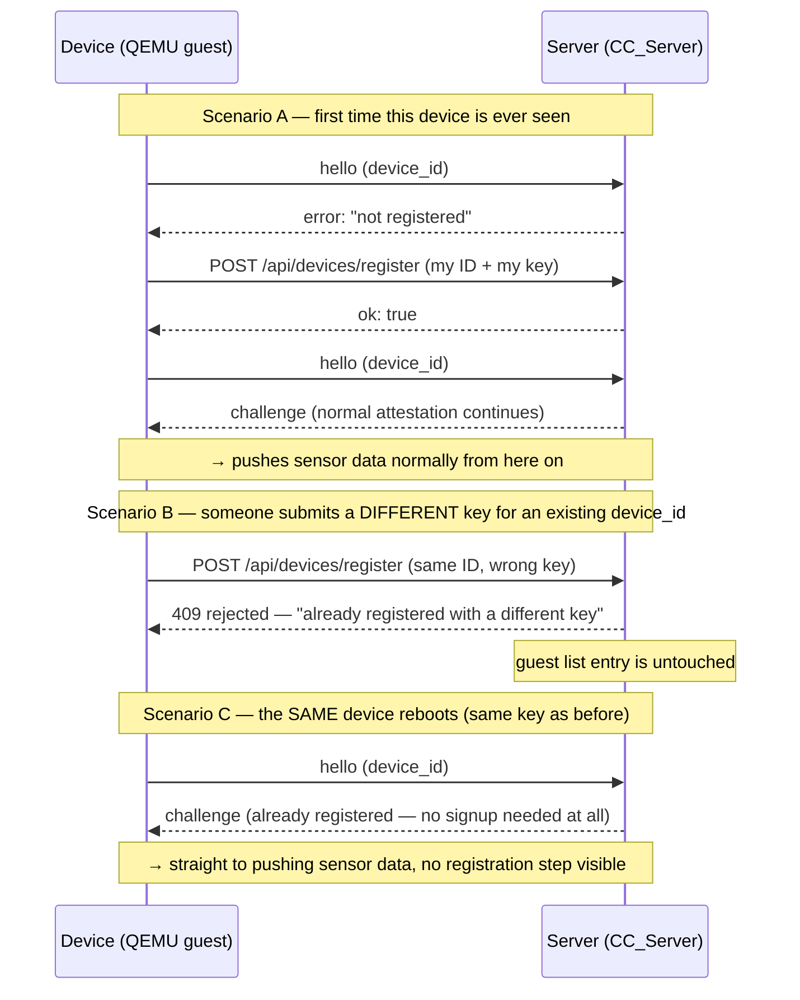

# Device self-registration — explained simply

**Mission:** `docs/HANDOFF_MISSIONS.md` §2.2.b — *"Any re-POST silently overrides a device
registration."*
**Status:** implemented, and verified for real on live QEMU + a live server (not just unit
tests) — see §5.

This doc explains the same patch as before, but slower and with pictures. If you only read one
section, read §1 and look at the diagram in §2.

---

## 1. The idea, in one paragraph

Think of the management server as a nightclub with a guest list (`device_registry.json`). Before
this patch, two things were broken:

1. **No self check-in.** A new device would show up, and a *human* had to manually copy its ID
   card and add it to the list before it could get in. Annoying, and easy to forget.
2. **Anyone could rewrite the guest list.** If someone submitted *"hi, I'm device X, here's my
   ID"* for a device that was already on the list, the club just believed them and swapped in the
   new ID — no check that it was actually the same device. A fake device could steal a real
   device's spot.

This patch fixes both: **the device signs itself in automatically**, and **the guest list refuses
to overwrite an existing entry with a different ID** — it only ever accepts a first-time signup or
confirms "yep, still you."

---

## 2. The three behaviors, as one picture

That's the whole feature. Everything below is just "which file does which arrow."

---

## 3. Who does what — one line per file

Picture the system as two computers talking over the network: the **device** (code that runs
inside the QEMU guest) and the **server** (`CC_Server`, a Python process on your host machine).

### Device side (the guest)

| File | What it does in this story |
|---|---|
| `project/buildroot/packages.conf` | Installs `curl` inside the guest, so it has a way to *speak HTTPS* at all. Before this, the guest's only HTTP tool (`wget`) couldn't do HTTPS, and the server only accepts HTTPS. |
| `scripts/build-project.sh` | Small build-system fix so that adding `curl` above actually takes effect on a rebuild (a Buildroot quirk, not interesting on its own). |
| `.../scripts/provision-device.sh` | Already prints the device's "ID card" (its public key + a boot measurement) on every boot. This patch also **saves that ID card to a file** (`enrollment.json`) so the device's own program can read it later and mail it to the server itself. |
| `.../edge_device/host/edge_device.c` | The actual device program. New logic: *"if the server says it doesn't know me, read my saved ID card and POST it to the server myself."* This is the self-check-in. |
| `scripts/run-project.sh` | Just wiring — makes sure the device knows *which port* to send that self-registration POST to (the server has two ports: one for normal sensor traffic, one for admin actions like registering). |

### Server side (`CC_Server`)

| File | What it does in this story |
|---|---|
| `CC_Server/server/device_registry.py` | **The guest list itself.** New rule: unseen ID → add it. Same ID + same key → do nothing (already on the list). Same ID + *different* key → refuse, and don't touch the list. Also locks the guest-list file so only the server's own OS user can read/write it. |
| `CC_Server/server/app_server.py` | The front door (`POST /api/devices/register`). Just wires the rule above to an HTTP response: success, or `409 Conflict` if rejected. |
| `CC_Server/server/tests/test_device_registry.py` | Automated tests proving the guest-list rule above actually behaves as described (new ID, same key, different key, file permissions). |

### Documentation

| File | What it does |
|---|---|
| `docs/verify/*.md` | Three step-by-step, do-it-yourself scripts for reproducing Scenarios A, B, and C live on real QEMU — what we actually ran this session. |

---

## 4. A couple of "why" questions you'd probably ask

**Q: Why does the device use `curl` instead of just... some simpler way to send the request?**
A: The server only speaks HTTPS with a fairly modern encryption version (TLS 1.3). The guest's
built-in tool (`wget`) can't do HTTPS at all in this stripped-down Linux image. `curl` is a real
HTTP client that can. There wasn't a lighter option available.

**Q: Why "guest-list file with locked permissions" instead of some kind of admin password to allow
overriding a registration?**
A: That was a genuine design choice (not the only valid one — the original mission doc actually
suggested an admin token/password instead). The reasoning here: *whoever can already read/edit the
server's files* (the person running the server, or someone with `sudo`) already has full control
of the machine — adding a password on top of that wouldn't really add security, just an extra
step. So instead: normal registration can never overwrite anything, and if a real re-provision is
ever needed, an admin just edits the file directly. Simpler, at the cost of no "self-service
override" through the API.

**Q: What stops a fake device from just registering itself with a made-up ID before the real one
boots?**
A: Nothing, today — first-come-first-served is how self-registration works. That's an accepted
trade-off for this project's scope (see `docs/HANDOFF_MISSIONS.md` for what's explicitly
in/out of scope). What this patch *does* guarantee is that **once** a real ID is registered, it
can't be silently taken over later — that was the actual problem being fixed (§2.2.b).

---

## 5. What we actually tested (not just imagined)

All three scenarios in §2 were run for real, live, this session — a real QEMU device talking to a
real running server, not a simulation:

- **Scenario A:** booted a brand-new device → watched it print
  `not registered, attempting self-registration...` → `registered with the management server` →
  start pushing data, with zero manual steps.
- **Scenario B:** sent a fake key for an already-registered device by hand (`curl`) → got
  `409` back, and confirmed the real device's key in the guest list was completely unchanged
  afterward.
- **Scenario C:** rebooted the same device (same disk, same key) → it went straight to pushing
  data, no registration chatter at all — and the guest-list entry's timestamp was byte-for-byte
  identical before and after the reboot, proving nothing got rewritten.

Along the way we also hit a **real gotcha worth remembering** if you reproduce this yourself: the
server loads the guest list into memory once when it starts and never re-reads the file — so
editing `device_registry.json` by hand while the server is still running has no effect until you
restart it.
