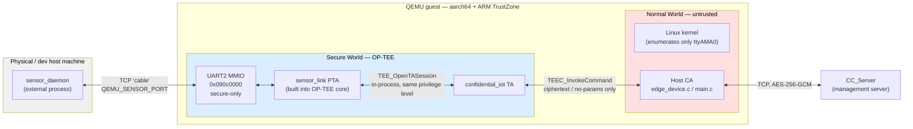
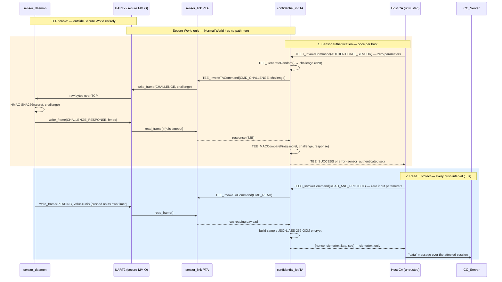

# Sensor Path Implementation: Secure-UART PTA + Real HMAC Authentication

Resolves `docs/HANDOFF_MISSIONS.md`'s "Natalie / Emily — the sensor path"
missions (2.3.a, 2.3.b) and the "Known architectural gap" previously
recorded in `docs/ARCHITECTURE.md`. This document explains what was built,
why, exactly what changed file by file, and how it was verified.

## What changed, in one line

The Sensor Module is now a genuinely separate process (`sensor_daemon`)
holding a hardcoded-but-not-compiled-in pre-shared secret, connected to the
Edge Device over a UART that is physically unreachable from Normal World —
so both the sensor's HMAC-SHA256 authentication and its data readings now
travel end-to-end without the untrusted Host CA ever touching plaintext,
replacing the previous stub (`ta_authenticate_sensor` always-true, readings
from a TA-internal mock counter).

---

## How it works

### Topology and trust boundary

The key property this diagram is meant to make obvious: there is **no
arrow that crosses from `sensor_daemon` into the Normal-World box**. The
only path in or out of Secure World from the sensor's side is through
`Host`, and every message on that specific arrow is either empty
(`AUTHENTICATE_SENSOR` takes no parameters) or ciphertext
(`READ_AND_PROTECT`'s output). `Linux` is drawn separately from `Host` to
make the point that even the Host CA process's own kernel (Linux) has no
device node for UART2 at all — it isn't a permissions question, the
hardware is invisible to that whole box.

### Protocol flow (sequence)

Two things worth calling out about this flow:

- **The Host's two calls are identical in shape to a stub — deliberately.**
  `AUTHENTICATE_SENSOR` and `READ_AND_PROTECT` both look, from the Host's
  point of view, like "invoke a command, get a result." The Host cannot
  tell, and does not need to know, that a whole challenge-response protocol
  or a hardware read happened underneath — that entire sub-conversation
  (the top rectangle and the `SD ↔ U2 ↔ PTA ↔ TA` legs of the bottom
  rectangle) is invisible to it.
- **`sensor_daemon` never blocks waiting to be asked for a reading.** It
  pushes `READING` frames on its own ~2s timer once authenticated; `CMD_READ`
  just blocks until the next one arrives. This matters for a real bug found
  during verification — see "Verification performed" below.

---

## PTA terminology: what a "pseudo-TA" is, and why this had to be one

**TA (Trusted Application).** Ordinary secure-world code in OP-TEE is a TA:
a separate, signed ELF binary, loaded on demand, running in its own
sandboxed address space at the CPU's unprivileged secure exception level
(S-EL0). `confidential_iot` (this project's own TA) and `optee_ftpm` (the
software TPM) are both ordinary TAs. Normal World reaches a TA via the TEE
Client API (`TEEC_OpenSession`/`TEEC_InvokeCommand`); one TA can reach
another via the TEE Internal Core API's `TEE_OpenTASession`. Either way, the
GlobalPlatform model treats every TA as an isolated, individually loaded
"application" — it cannot touch another TA's memory, and it cannot touch
hardware directly. A TA only gets memory the OS hands it (`TEE_Malloc`,
shared memory) and only talks to the outside world through the fixed
4-parameter command interface. That sandboxing is the whole point of a TA —
but it also means an ordinary TA has **no way to map an arbitrary physical
MMIO peripheral**, such as a UART, and read/write its registers directly.
Only code that is part of OP-TEE core itself has that privilege.

**PTA (Pseudo Trusted Application).** A PTA is not a separate binary at
all — it is C code **compiled directly into OP-TEE core**, running at the
same privileged secure level as the OS itself (S-EL1, "kernel" in secure
world), registered by a `pseudo_ta_register(...)` macro that places a
small descriptor (UUID + entry points) into a linker-collected table core
scans at startup. From the *caller's* side, a PTA is indistinguishable from
a real TA: it has a UUID, it's opened with the same
`TEE_OpenTASession`/`TEEC_OpenSession` calls, it's invoked with the same
`TEE_InvokeTACommand`/`TEEC_InvokeCommand`, using the same 4-parameter
convention. That's the "pseudo" in the name: it **pretends to be an
application** at the API level — same addressing (UUID), same calling
convention, same session lifecycle — while structurally being core
firmware, not a loaded, sandboxed, individually-signed binary. OP-TEE's own
built-in examples (`core/pta/system.c`, `core/pta/hwrng.c`, the System PTA
that exposes the TCG event log to the fTPM) are all PTAs for exactly this
reason: they need privileges (raw hardware access, core internals) that a
sandboxed user TA structurally cannot have.

**Why `sensor_link` specifically had to be a PTA, not a TA.** Owning UART2
means calling `register_phys_mem_pgdir()` to map a specific physical
address range into secure memory, and driving that hardware directly via
`core/drivers/pl011.c`. Neither operation is available to a sandboxed user
TA — mapping arbitrary physical MMIO is a core-level privilege by design
(letting a TA do it would defeat the isolation between TAs, and between a
TA and the platform). So `sensor_link` had to live inside OP-TEE core, as a
PTA, or the secure-UART design wouldn't have been possible at all — this
wasn't a stylistic choice, it's the only mechanism this architecture makes
available for secure-world code to own a hardware peripheral.

**Why calling it costs nothing extra.** Because a PTA lives inside core,
resolving `TEE_OpenTASession(&sensor_link_uuid, ...)` from the
`confidential_iot` TA never leaves Secure World and never round-trips
through Normal World: `tee_ta_init_session()` first checks the
linker-collected PTA table by UUID (`tee_ta_init_pseudo_ta_session()` in
`core/kernel/pseudo_ta.c`) before ever considering loading a separate user
TA ELF. A match resolves as a plain, synchronous C function call on the
calling thread's own stack — no SMC, no scheduler yield, no
`tee-supplicant` involvement. That in-process call is exactly what keeps
the whole authentication/read exchange inside Secure World end to end.

**The one thing a PTA doesn't get for free: access control.** Because a PTA
is reachable through the *same* `TEE_OpenTASession`/`TEEC_OpenSession` path
a raw Normal-World client could use, nothing stops an untrusted caller from
trying to open a session to it directly, unless the PTA itself checks who's
calling. `sensor_link.c`'s `open_session_entry_point` does exactly that: it
calls `ts_get_calling_session()` + `is_user_ta_ctx()` to reject anything
that isn't an ordinary user TA, then compares the caller's UUID against
`SENSOR_LINK_ALLOWED_CALLER_UUID` (`confidential_iot`'s own UUID) and
rejects everything else. Without this check, a compromised Normal-World
process could open a session to `sensor_link` directly and drive the UART
itself — bypassing `confidential_iot`'s HMAC verification entirely.

---

## File-by-file: everything added or changed

### New files

**`project/patches/virt-uart2.patch`** — the QEMU machine-model patch.
Adds a third PL011 UART (`VIRT_UART2`) to the `virt` machine:
- `include/hw/arm/virt.h`: new enum value `VIRT_UART2`.
- `hw/arm/virt.c` `base_memmap[]`: `{ 0x090c0000, 0x00001000 }` — free space
  between `VIRT_SECURE_GPIO` (ends `0x090b1000`) and `VIRT_MMIO`
  (`0x0a000000`).
- `hw/arm/virt.c` `a15irqmap[]`: SPI 10 — free between `VIRT_ACPI_GED` (9)
  and `VIRT_MMIO` (16..47).
- `hw/arm/virt.c` machine-init: `create_uart(vms, VIRT_UART2, secure_sysmem,
  serial_hd(2), true)`, added *before* the existing UART1 secure-creation
  call (so `/secure-chosen/stdout-path` still ends up pointing at UART1 —
  cosmetic, since neither TF-A nor OP-TEE actually consult that DT
  property, but keeps behavior unchanged). `secure=true` reuses
  `create_uart()`'s existing isolation path unmodified: DT node
  `status="disabled"` for Normal World, `secure-status="okay"`, MMIO placed
  in `secure_sysmem` — the *exact* mechanism UART1 (OP-TEE's own console)
  already relies on.
- Applied idempotently by `scripts/sync-project.sh` via `git apply
  --reverse --check` (the `.optee-workspace/qemu/` checkout is a real git
  repo, so this survives repeated `repo sync` + resync cycles without
  double-applying or hand-editing a generated tree).

**`project/optee_os_ext/core/pta/sensor_link.c`** — the PTA itself (see
"PTA terminology" above for what this is and why it exists). Responsibilities:
- Owns UART2 via the existing `core/drivers/pl011.c` driver (no new UART
  driver written) — `register_phys_mem_pgdir(MEM_AREA_IO_SEC,
  SENSOR_UART_BASE, PL011_REG_SIZE)` at file scope (this macro expands to a
  linker-collected declaration and must be file-scope, not called from
  inside a function — a real compile error hit and fixed during
  implementation), with the actual `pl011_init()` hardware-programming call
  deferred into a lazily-invoked `sensor_uart_ensure_init()`.
- Implements the wire framing (`write_frame`/`read_frame`,
  `[1B type][2B length BE][payload]`) and a bounded busy-poll read
  (`have_rx_data()` + `mdelay(1)`, ~2s timeout) so a dead/absent
  `sensor_daemon` fails the caller instead of hanging the TA forever.
- Exposes `PTA_SENSOR_LINK_CMD_CHALLENGE` (write a challenge, block for the
  response) and `PTA_SENSOR_LINK_CMD_READ` (block for one reading frame).
- `open_session_entry_point` allowlists only the `confidential_iot` TA's
  UUID (see "The one thing a PTA doesn't get for free" above).
- Registered via `pseudo_ta_register(...)`, gated behind a new
  `CFG_SENSOR_LINK_PTA` build flag (see `scripts/sync-project.sh` below) —
  **not** built unconditionally, because the file hardcodes a
  QEMU-`virt`-specific MMIO address meaningless on any other OP-TEE
  platform.

**`project/optee_os_ext/lib/libutee/include/pta_sensor_link.h`** — the
shared header between the PTA and the TA: the PTA's UUID
(`7d9f6d20-...-0002`, a sibling of the TA's own `...0001`), the caller
allowlist UUID (duplicated from `confidential_iot_ta.h` — the PTA lives in
a different build tree with no include path back into the TA's project, so
this is a deliberately duplicated, cross-referenced constant, the same
pattern already used elsewhere in this project e.g. the anti-replay AAD
size matching the server's Python), the two command IDs, the wire-frame
type bytes, and the `READING` payload layout (`[4B big-endian int32
value][1B unit_len][unit_len ASCII unit]` — an integer, not a float,
specifically to avoid depending on floating-point `printf` support inside
the TA's minimal libc).

**`project/optee_examples/confidential_iot/sensor_module/sensor_daemon.c`**
— the Sensor Module companion process. Replaces the two dead stub files
(see "Deleted files" below); not preserving their old function shapes,
since those (`get_identity`, `respond_to_challenge`, `get_measurements`)
were empty no-ops with no logic worth carrying forward and didn't fit the
new framed protocol. Responsibilities:
- Listens as a TCP server on `--port` (the daemon is the server side;
  QEMU's UART2 chardev is the client — see "`run-project.sh` sequencing"
  below for why this direction matters).
- Loads its copy of the pre-shared secret from `--secret <path>`, a local
  file, never compiled in.
- Answers `CHALLENGE` frames with `HMAC-SHA256(secret, challenge)`
  (OpenSSL's `HMAC()`/`EVP_sha256()` — `libssl-dev` was already a native
  Dockerfile dependency, so no new build dependency was needed).
- Pushes synthetic `READING` frames (a fake temperature, 20–29°C) on a
  timer, but **only after the first successful challenge-response** — see
  the FIFO-overflow bug in "Verification performed" below for why this
  gating exists.
- Line-buffers stdout/stderr explicitly (`setvbuf(..., _IOLBF, 0)`) since
  it normally runs backgrounded with output redirected to a log file —
  fully-buffered glibc stdio would otherwise sit unflushed for the whole
  process lifetime, discovered while debugging the FIFO-overflow issue.

**`project/optee_examples/confidential_iot/sensor_module/sensor_link_proto.h`**
— a plain-C mirror of `pta_sensor_link.h`'s wire-format constants (frame
type bytes, sizes), for `sensor_daemon.c` to use. Genuinely duplicated
(not `#include`d) because the daemon is a plain host binary built outside
the OP-TEE SDK entirely and has no include path to the TA-side headers.

**`project/optee_examples/confidential_iot/sensor_module/Makefile`** — a
**native** (not cross-compiled) build for `sensor_daemon`, since it runs on
the physical/dev host, not inside the QEMU guest. Links `-lssl -lcrypto`.

**`scripts/pair-sensor.sh`** — generates (or reuses, idempotently) one
random 32-byte secret, writes it to a host-side file `sensor_daemon` reads
via `--secret`, and prints it base64-encoded to stdout for
`scripts/run-project.sh` to deliver into the guest as a command-line
argument. (See "Provisioning" below for why base64-over-the-console rather
than a shared file.)

### Modified files

**`edge_device/ta/include/confidential_iot_ta.h`** — the TA/Host shared
command header:
- `TA_CONFIDENTIAL_IOT_CMD_AUTHENTICATE_SENSOR` (id 0): doc comment
  rewritten from "stub, always succeeds" to describe the real HMAC flow;
  the command itself is unchanged (still zero parameters — the Host was
  already correctly shaped for this, since the real check moved entirely
  behind the PTA rather than needing Host-relayed parameters).
- `TA_CONFIDENTIAL_IOT_CMD_READ_AND_PROTECT` (id 1): **repurposed** from
  the old `PROCESS_SENSOR_DATA`. New shape: no input parameters at all;
  outputs `params[0]`=12-byte nonce, `params[1]`=ciphertext‖16-byte tag,
  `params[2].value.a`=sequence number.
- Old `PROTECT_SENSOR_DATA` (id 2): **retired**, left unassigned rather
  than reused, with a comment explaining why (folded into id 1).
- `TA_CONFIDENTIAL_IOT_CMD_PROVISION_SENSOR_SECRET` (id 5, new): one-time,
  idempotent write of a 32-byte secret into TA secure storage.
- New size constants: `TA_CONFIDENTIAL_IOT_READING_MAX` (256 — chosen so
  base64(nonce+ciphertext+tag) ≈ 380 bytes still fits every existing
  downstream buffer unchanged, avoiding the buffer-size ripple
  `docs/HANDOFF_MISSIONS.md` had flagged as a risk) and
  `TA_CONFIDENTIAL_IOT_SENSOR_SECRET_SIZE` (32).

**`edge_device/ta/trusted_app.h`** — `struct confidential_iot_session`:
- `mock_reading[64]` / `mock_reading_len` → renamed `reading[256]` /
  `reading_len` (sized from the new `TA_CONFIDENTIAL_IOT_READING_MAX`).
- Added `TEE_TASessionHandle sensor_pta_sess` and `bool sensor_pta_open` —
  caches the session to the `sensor_link` PTA across the TA session's
  whole lifetime (opened lazily on first use, closed in
  `TA_CloseSessionEntryPoint`) instead of reopening it on every call.
- Added `#include <confidential_iot_ta.h>` (needed for the new size
  constant used in the struct definition).
- Function prototypes updated: `ta_process_sensor_data` +
  `ta_protect_sensor_data` replaced by `ta_read_and_protect`; new
  `ta_provision_sensor_secret`.

**`edge_device/ta/trusted_app.c`** — the TA implementation:
- Removed the file-scope `g_mock_value` counter entirely.
- New `open_sensor_pta()` helper: lazily opens and caches the session to
  the `sensor_link` PTA (`TEE_OpenTASession`, matching the exact pattern
  OP-TEE core's own `tee_system_pta.c` uses for calling the System PTA).
- `ta_authenticate_sensor` rewritten from a one-line stub into the real
  check: `TEE_OpenPersistentObject` reads the pre-shared secret from secure
  storage → `TEE_GenerateRandom()` a 32-byte challenge →
  `TEE_InvokeTACommand(CMD_CHALLENGE)` on the PTA session →
  `TEE_MACCompareFinal()` (HMAC-SHA256) verifies the response → sets
  `sensor_authenticated` only on a genuine match; the secret buffer is
  wiped (`TEE_MemFill`) before every return path.
- New `read_sensor_reading()` helper: calls `CMD_READ` on the PTA,
  parses the `[value][unit]` payload, and formats the server's expected
  `{"samples":[{"value":N,"unit":"..."}]}` JSON into `sess->reading`.
- New `ta_read_and_protect` (replacing `ta_process_sensor_data` +
  `ta_protect_sensor_data`): enforces the same two gates as before
  (`sensor_authenticated && session_key_valid`), calls
  `read_sensor_reading()`, then reuses the **existing, unchanged**
  AES-256-GCM sealing body (random nonce, `send_seq`-as-AAD, `TEE_AEInit`/
  `TEE_AEUpdateAAD`/`TEE_AEEncryptFinal`) verbatim — only the plaintext's
  *source* changed, not the proven crypto path.
- New `ta_provision_sensor_secret`: `TEE_CreatePersistentObject` under
  object id `"ciot.sensor.psk"` (`TEE_STORAGE_PRIVATE`); a second call
  returns `TEE_ERROR_ACCESS_CONFLICT`, treated as a successful idempotent
  no-op (mirrors `provision-device.sh`'s AK-exists gate).
- `TA_OpenSessionEntryPoint`/`TA_CloseSessionEntryPoint`: initialize/tear
  down `sensor_pta_sess`/`sensor_pta_open` alongside the existing fields.
- `TA_InvokeCommandEntryPoint`: switch statement updated for the new
  command set (`AUTHENTICATE_SENSOR` → real, `READ_AND_PROTECT` replacing
  the two old cases, new `PROVISION_SENSOR_SECRET` case).

**`edge_device/host/edge_device.c`** — the Host CA:
- **Deleted** `edge_get_sensor_data()` — a dead, superseded stub (confirmed
  unreferenced anywhere) with no reason to keep it.
- `ta_protect_and_encode()` → renamed `ta_read_and_protect_encode()`: the
  `input`/`input_size` parameters (the Host-supplied plaintext the TA
  always ignored) are **removed entirely**, along with the now-meaningless
  `input_size > sizeof(ciphertext) - 16` guard. `op.paramTypes` changed
  from `(MEMREF_INPUT, MEMREF_OUTPUT, MEMREF_OUTPUT, VALUE_OUTPUT)` to
  `(MEMREF_OUTPUT, MEMREF_OUTPUT, VALUE_OUTPUT, NONE)` — no input slot at
  all (see "Why the Host never sees plaintext" below).
- New `edge_provision_sensor_secret()`: invokes
  `CMD_PROVISION_SENSOR_SECRET` with the 32-byte secret as a single input
  parameter.
- **Deleted** `edge_process_sensor_data()` — folded into the single
  `READ_AND_PROTECT` call.
- `edge_call_ta()` simplified from `(cmd_id, input, input_size, output,
  output_size)` to just `(output, output_size)` — there is now exactly one
  real command to dispatch, so the generic `cmd_id`-switch wrapper (with
  its stale `// TODO`) was removed rather than kept for a single case.

**`edge_device/host/edge_device.h`** — declarations updated to match:
added `#include <confidential_iot_ta.h>` (for the secret-size constant),
removed `edge_get_sensor_data`/`edge_process_sensor_data` prototypes, added
`edge_provision_sensor_secret`, simplified the `edge_call_ta` prototype,
and updated the doc comments that referenced the old `PROTECT_SENSOR_DATA`
command name.

**`edge_device/host/main.c`**:
- `main()` signature changed from `(void)` to `(int argc, char *argv[])`.
- New `provision_sensor_secret_mode()` + a CLI dispatch (`--provision-sensor-secret
  <base64>`) at the top of `main()`: decodes the base64 argument (reusing
  `mbedtls_base64_decode`, already linked for the attestation protocol —
  new `#include <mbedtls/base64.h>`), calls
  `edge_provision_sensor_secret()`, and exits — a one-shot mode on the same
  binary rather than a separate provisioning tool, reusing
  `edge_device_init()`'s TEEC session exactly like `provision-device.sh`
  drives one binary for AK provisioning.
- Push loop: the old two-step `edge_process_sensor_data()` +
  `edge_call_ta(PROTECT_SENSOR_DATA, ta_in, ...)` collapsed into a single
  `edge_call_ta(protected_data, sizeof(protected_data))` call; the
  now-unused `ta_in[1]` throwaway input buffer removed.

**`project/optee_examples/confidential_iot/CMakeLists.txt`** — removed
`sensor_module/sensor_module.c` and `sensor_module/secure_element.c` from
the guest binary's `add_executable()` sources and dropped the
`sensor_module` include directory; added a comment explaining that
`sensor_daemon` is deliberately **not** part of this target (it runs
outside the QEMU guest, built separately — see the new
`sensor_module/Makefile`).

**`edge_device/host/Makefile`** — same removal for the parallel plain-Make
build path (`OBJS` and `-I../../sensor_module` dropped).

**`scripts/sync-project.sh`** — five additions, each following the file's
existing idempotent-patch conventions:
1. A third QEMU serial port: `QEMU_SENSOR_PORT ?= 54322` plus a third
   `-serial tcp:127.0.0.1:$(QEMU_SENSOR_PORT)` appended to
   `QEMU_RUN_ARGS`, mirroring the existing `QEMU_GDB_PORT` sed-patch.
2. Applies `project/patches/virt-uart2.patch` to the workspace's QEMU
   checkout via the `git apply --reverse --check` idempotency idiom
   described above.
3. Copies `sensor_link.c` and `pta_sensor_link.h` from the tracked
   `project/optee_os_ext/` into the generated (git-ignored) `optee_os/`
   checkout — plain `cp`, naturally idempotent, unlike the QEMU patch
   there's no upstream content to conflict with.
4. Patches `core/pta/sub.mk`: `srcs-$(CFG_SENSOR_LINK_PTA) += sensor_link.c`,
   matching that file's existing `srcs-$(CFG_*)` convention exactly (every
   other PTA in that file is gated the same way).
5. Patches `qemu_v8.mk`: `OPTEE_OS_COMMON_FLAGS += CFG_SENSOR_LINK_PTA=y`,
   enabling the flag for this project's build specifically (not globally —
   see why in the `sensor_link.c` description above).

**`scripts/run-project.sh`**:
- New `QEMU_SENSOR_PORT` (per-`QEMU_INSTANCE` offset, same scheme as
  `QEMU_NW_PORT`/`QEMU_SW_PORT`), threaded through the Docker `-e` list.
- New `SENSOR_SECRET_FILE`/`SENSOR_DAEMON_BIN` variables.
- **Sequencing fix** (see "`run-project.sh` sequencing" below):
  `pair-sensor.sh` and the `sensor_daemon` launch were moved to run
  **before** `tmux new-session` starts QEMU, not after device provisioning
  as originally written — QEMU needs something listening on the sensor
  port at machine-init time, not lazily.
- Inside the post-login automation subshell: after device provisioning
  succeeds, a new step sends
  `optee_example_confidential_iot_edge --provision-sensor-secret
  '<base64>'` into the guest console and waits for `CIOT_PAIR_DONE=`,
  pushing the already-running daemon's secret into the TA before the edge
  binary's normal push loop starts.

**`scripts/build-project.sh`** — one addition: `make -C
project/optee_examples/confidential_iot/sensor_module`, building
`sensor_daemon` natively as part of the standard full build, entirely
independent of the OP-TEE/Buildroot cross-compilation pipeline around it.

**`.gitignore`** — one addition: the compiled `sensor_daemon` binary
(extensionless, so not caught by the existing `*.o`/`*.a`/`*.elf`
patterns; everything else new is either source or already covered by the
existing `.device-state/` ignore for runtime secrets/logs).

**`docs/ARCHITECTURE.md`, `docs/HANDOFF_MISSIONS.md`,
`docs/ATTESTATION_DESIGN.md`** — updated to mark the sensor path resolved
and cross-reference this document (component map, the "Known architectural
gap" section replaced with a "RESOLVED" summary, the Natalie/Emily mission
marked resolved, §2.6 annotated as superseded).

### Deleted files

**`sensor_module/secure_element.c` / `.h`** and **`sensor_module/sensor_module.c`
/ `.h`** — the original stub files (`get_identity`, `respond_to_challenge`,
`get_measurements`, all empty no-ops returning 0). Confirmed unreferenced
anywhere else before deletion. These were never a separate process before
this work — they were plain `.o` files statically linked directly into the
Host CA binary (see `docs/ARCHITECTURE.md`'s pre-existing description), so
"the sensor" didn't exist as a distinct component at all until
`sensor_daemon.c` replaced them.

---

## Provisioning: `pair-sensor.sh`

`scripts/pair-sensor.sh` generates (or reuses) one random 32-byte secret
and makes it available to both consumers, neither of which is a git-tracked
source file:

1. The raw bytes go to a host-side file `sensor_daemon` reads via
   `--secret <path>`.
2. The same bytes, base64-encoded, are printed to stdout for
   `run-project.sh` to inject into the guest as a `--provision-sensor-secret
   <base64>` command-line argument.

There is no shared filesystem between the host/container and the QEMU
guest, so step 2 can't be a file copy — it travels over the tmux-driven
console the same way `provision-device.sh`'s `device_id`/`server_host`/
`server_port` arguments already do. `main.c` decodes it with
`mbedtls_base64_decode` (already linked) rather than needing any new
guest-side tool (an earlier draft used hex + `xxd`, which isn't guaranteed
to exist in this minimal Buildroot rootfs; base64 via a library already
compiled into the binary sidesteps that entirely).

## `run-project.sh` sequencing — a real gotcha

`sensor_daemon` **must** be listening before QEMU starts: QEMU's
`-serial tcp:127.0.0.1:$(QEMU_SENSOR_PORT)` chardev (client mode, no
`,server`) connects out at machine-init time, not lazily on first UART
access. If nothing is listening yet, QEMU fails to start at all
(`Failed to connect ... Connection refused` — hit and diagnosed during
verification). So `pair-sensor.sh` and the daemon launch happen *before*
the `tmux new-session` that runs QEMU; only pushing the secret into the TA
(`--provision-sensor-secret`) waits for login, since that step needs the
guest shell to exist.

---

## Why the Host never sees plaintext

Two independent guarantees, not just one:

1. **Structural (parameter shape).** `edge_device.c`'s
   `edge_authenticate_sensor()` invokes `AUTHENTICATE_SENSOR` with
   `TEEC_PARAM_TYPES(TEEC_NONE, TEEC_NONE, TEEC_NONE, TEEC_NONE)` — zero
   parameter slots. `ta_read_and_protect_encode()` invokes
   `READ_AND_PROTECT` with all three used params as
   `TEEC_MEMREF_TEMP_OUTPUT`/`TEEC_VALUE_OUTPUT` — no input slot exists.
   There is no parameter through which sensor plaintext, the challenge, or
   the response could cross into a Host-owned buffer, in any run, by
   construction — not merely "wasn't observed to leak in this run."
2. **Physical (UART2 isolation).** Confirmed empirically: Normal World
   Linux's boot log shows only `ttyAMA0`; grepping the full boot log for
   the UART1/UART2 MMIO addresses returns nothing. The bytes that *do*
   carry the challenge/response/reading only ever transit UART2, which
   Normal World cannot address at all — not a permissions restriction, the
   device tree node is `status="disabled"` and the kernel never even
   attempts to probe it.

---

## Verification performed

All of the following were run against a real build (`scripts/build-project.sh`)
and a real boot (`scripts/run-project.sh`), not just compiled:

1. **UART2 isolation** — `dmesg | grep ttyAMA` shows only `ttyAMA0`; no
   `0x09040000` (UART1) or `0x090c0000` (UART2) anywhere in the Normal
   World log.
2. **Positive path** — with the daemon serving the correct, provisioned
   secret: `ta_authenticate_sensor` succeeds, `sensor_authenticated` goes
   true, the edge binary reaches its push loop.
3. **Negative path** — with the daemon serving a deliberately *wrong*
   32-byte secret (same TA-provisioned secret left in place on the
   persistent disk): the daemon still answers the challenge (proving the
   link itself works), but `TEE_MACCompareFinal()` correctly rejects the
   mismatched HMAC, `sensor_authenticated` stays false, and
   `edge_authenticate_sensor()` fails — the process exits before ever
   reaching the push loop. This confirms the gate is real, not a stub.
4. **A real bug found and fixed along the way**: the daemon originally
   started pushing unsolicited `READING` frames on a timer immediately
   upon connection — but the connection is accepted at QEMU boot, while
   the TA's first read (the challenge round trip) doesn't happen until
   minutes later (after login/provisioning). The unread backlog overflowed
   the PL011's small RX FIFO before the TA ever looked at it, corrupting
   the stream so badly that even the first, otherwise-correct
   `CHALLENGE_RESPONSE` arrived unreadable. Fixed by gating the periodic
   push behind the first successful authentication (`sensor_daemon.c`).
5. **A second, more mundane bug** found during the same debugging pass:
   `sensor_daemon`'s stdout was fully buffered (not a tty), so its log file
   stayed empty for the whole process lifetime, masking what was actually
   happening. Fixed with explicit `setvbuf(..., _IOLBF, 0)`.

**Known gap in this verification, not in the implementation:** the full
`READ_AND_PROTECT` path (real sensor readings actually reaching a live
`CC_Server`) could not be exercised inside the sandboxed test environment
used for this work — the device-facing attestation handshake (pre-existing,
unrelated to this change) couldn't reach a separately-launched server
container over `10.0.2.2` there. That device↔server path is unmodified by
this work and already documented as verified in `docs/ATTESTATION_TESTING.md`;
re-running `scripts/run-project.sh` against a real `docker compose up`
`CC_Server` (as that doc describes) is the way to see a `pushed sensor
reading` line with genuine sensor data end to end.
